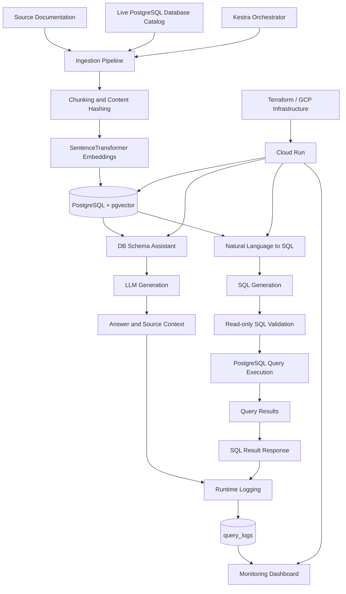

# DB Schema & Query Assistant

An evaluation-driven **Retrieval-Augmented Generation (RAG) system for database knowledge and natural-language querying**.

The system transforms database documentation and metadata into a searchable knowledge base, allowing users to ask questions about table schemas, column descriptions, relationships, and operational notes in natural language. It also provides a **Natural Language → SQL** workflow that retrieves relevant schema context, generates a single SQL statement, validates it for read-only execution, and executes it against PostgreSQL.

The project uses **PostgreSQL + pgvector** as the knowledge store and follows the learning foundation of the **DataTalksClub LLM Zoomcamp**. It extends the course concepts into an end-to-end AI application covering ingestion, embeddings, retrieval, generation, NL2SQL safety controls, evaluation, monitoring, orchestration, and Google Cloud deployment.

---
## Executive Summary

Engineering and DBA teams frequently spend time searching for database knowledge distributed across DDL files, table and column comments, design notes, internal documentation, and individual experience.

This project addresses that problem by creating a shared, searchable knowledge layer for database schema documentation and metadata.

The system provides two assistants:

* **DB Schema Assistant** — answers natural-language questions about database structures and documentation using retrieved context and source references.
* **Natural Language → SQL** — converts natural-language questions into validated, read-only SQL queries and executes them against PostgreSQL.

Both assistants use the same indexed knowledge base and share a common monitoring layer. The application is designed to support both local experimentation with Ollama and cloud-based generation through an OpenAI-compatible API.

The project emphasizes the complete AI application lifecycle:

```text
Ingestion
    ↓
Chunking and Embedding
    ↓
Vector Storage
    ↓
Retrieval
    ↓
Generation
    ↓
Validation / Execution
    ↓
Evaluation
    ↓
Monitoring
    ↓
Deployment
```

The goal is not only to demonstrate a working RAG application, but also to explore the engineering considerations required to make an AI system measurable, repeatable, observable, and safer to operate.

---
## Architecture Diagram

The system separates source-data ingestion, searchable knowledge storage, assistant workflows, and runtime monitoring.



**Main Architectural Components**

| Component             | Responsibility                                                                                     |
| --------------------- | -------------------------------------------------------------------------------------------------- |
| Source documents      | DDL, Markdown notes, schema descriptions, and other supported text-based documentation             |
| PostgreSQL catalog    | Provides schema metadata from a live database                                                      |
| Ingestion pipeline    | Reads sources, chunks content, detects changes, creates embeddings, and updates the knowledge base |
| PostgreSQL + pgvector | Stores searchable document chunks and vector embeddings                                            |
| DB Schema Assistant   | Performs natural-language question answering over retrieved documentation                          |
| NL2SQL workflow       | Retrieves schema context, generates SQL, validates it, and executes read-only queries              |
| LLM provider          | Generates natural-language answers or SQL through a configurable OpenAI-compatible interface       |
| `query_logs`          | Stores runtime query information, timing data, model information, and user feedback                |
| Monitoring dashboard  | Provides visibility into usage, latency, assistant type, and feedback                              |
| Kestra                | Orchestrates repeatable and scheduled ingestion workflows                                          |
| Terraform / GCP       | Defines and provisions the cloud infrastructure                                                    |

---
## Engineering Focus

The project emphasizes the complete AI application lifecycle rather than only LLM prompting:

**Ingestion → Embedding → Retrieval → Generation → Validation → Execution → Evaluation → Monitoring → Deployment**

Key engineering areas include:

* Incremental document and database-catalog ingestion
* Semantic retrieval using **SentenceTransformers + pgvector**
* PostgreSQL full-text search and configurable hybrid retrieval
* Optional cross-encoder reranking
* Retrieval evaluation using **Hit Rate and MRR**
* Schema-aware NL2SQL generation
* Read-only SQL validation and automatic query limits
* Query and user-feedback logging
* Monitoring dashboards for latency, usage, and feedback
* Kestra-based ingestion orchestration
* Terraform-based deployment to **Google Cloud Platform**
* Cloud Run, Cloud SQL, Artifact Registry, and Secret Manager integration

The system is designed as a **portfolio-grade LLM Engineering project**, with an emphasis on measurable retrieval quality, safety, observability, reproducibility, and operational considerations.
 
---
## Key Capabilities

### Knowledge Ingestion

* Incremental ingestion rather than full index reconstruction.
* Content-hash-based change detection.
* Re-embedding only for new or modified chunks.
* Upsert of changed content using PostgreSQL conflict handling.
* Removal of stale chunks that no longer exist in the source.
* Support for local text and Markdown-based documentation.
* PostgreSQL database-catalog ingestion from live schema metadata.

### Retrieval-Augmented Generation

* Semantic retrieval using SentenceTransformers embeddings and pgvector.
* Optional PostgreSQL full-text search.
* Configurable hybrid retrieval using reciprocal rank fusion.
* Optional cross-encoder reranking.
* Exact table-name retrieval when a question explicitly identifies a table.
* Source-aware context construction for schema and documentation questions.

### Database Schema Assistant

* Natural-language questions about tables, columns, data types, and relationships.
* Retrieval over DDL, schema notes, comments, and database catalog metadata.
* Answers grounded in indexed documentation.
* Source context identifying the relevant table or document.

### Natural Language → SQL

* Natural-language questions converted into SQL.
* Schema context retrieved from indexed `db_catalog` information.
* Generation constrained to a single SQL statement.
* Read-only SQL validation.
* Automatic query limiting where applicable.
* Execution through PostgreSQL.
* Query results returned to the user.
* Runtime query logging and feedback capture.

### Evaluation

* Retrieval evaluation using **Hit Rate** and **Mean Reciprocal Rank (MRR)**.
* Comparison of semantic-only, keyword-only, hybrid, and hybrid-reranked retrieval.
* Generation evaluation using an LLM-as-judge workflow.
* Evaluation against project-specific questions rather than only synthetic examples.
* Measurement-driven decisions about retrieval complexity and model configuration.

### Monitoring and Observability

* Query logging for both assistants.
* Response-time tracking.
* Retrieval and generation timing information.
* Model and assistant identification.
* User feedback through thumbs-up and thumbs-down controls.
* Monitoring dashboard for usage, latency, and feedback trends.

### Model Flexibility

* Local model execution through Ollama.
* Cloud model execution through the Groq OpenAI-compatible API.
* Environment-based model switching.
* Shared application logic across local and cloud execution modes.
* Support for model experimentation using real project questions.

### Orchestration and Deployment

* Kestra workflows for local-file and database-catalog ingestion.
* Manual, scheduled, and webhook-triggered ingestion workflows.
* Docker Compose-based local development.
* Terraform-based Google Cloud infrastructure.
* Cloud Run services for the application and monitoring dashboard.
* Cloud SQL PostgreSQL deployment.
* Artifact Registry for container images.
* Secret Manager and IAM integration for cloud configuration.

---
## Quick Start ⭐⭐⭐

This quick start launches the application locally and allows you to test both assistants.

Choose one model execution mode:

* **Cloud model:** Groq API with `qwen/qwen3.8-27b`
* **Local model:** Ollama with `gemma3:4b`

### Prerequisites

Install:

* Git
* Docker
* Docker Compose
* Python

For the local-model option, Docker will also run the Ollama service.

### 1. Clone the Repository

```bash
git clone https://github.com/ketut-garjita/db-rag-assistant.git
cd db-rag-assistant
```

### 2. Choose a Model Configuration

#### Option A — Cloud Model

The cloud option uses the Groq OpenAI-compatible API.

```bash
cp docker-compose-without-ollama.yml docker-compose.yml
cp rag/nl2sql-cloud.py rag/nl2sql.py
cp .env.cloud .env
```

Open `.env` and configure the API key:

```dotenv
OPENAI_API_KEY=<your-groq-api-key>
OPENAI_BASE_URL=https://api.groq.com/openai/v1
LLM_MODEL=qwen/qwen3.8-27b
```

Do not commit `.env` or any file containing credentials.

#### Option B — Local Model with Ollama

The local option runs the LLM through Ollama in Docker.

```bash
cp docker-compose-with-ollama.yml docker-compose.yml
cp .env.local .env
cp rag/nl2sql-local.py rag/nl2sql.py
```

The local configuration uses:

```dotenv
OPENAI_API_KEY=ollama
OPENAI_BASE_URL=http://ai_ollama:11434/v1
LLM_MODEL=gemma3:4b
```

### 3. Start the Docker Compose Stack

```bash
docker compose up -d --build
```

Verify the services:

```bash
docker ps
```

For the local-model option, install the model inside the Ollama container:

```bash
docker exec ai_ollama ollama pull gemma3:4b
docker exec ai_ollama ollama list
```

On the first PostgreSQL initialization, the application creates the example Healthcare Data Platform schema together with the RAG and monitoring tables, including:

* Healthcare example tables and seed data
* `doc_chunks`
* `query_logs`

Existing PostgreSQL volumes are not automatically reinitialized.

### 4. Ingest the Knowledge Base

Run local-file ingestion:

```bash
docker exec db-rag-app \
  python /app/rag/ingestion/ingest.py \
  --source /app/data \
  --source-type local_file
```

Then ingest the PostgreSQL database catalog:

```bash
docker exec db-rag-app \
  python /app/rag/ingestion/ingest.py \
  --source "host=db port=5432 dbname=postgres user=postgres password=postgres" \
  --source-type db_catalog
```

The ingestion pipeline is incremental. Re-running these commands does not require unchanged chunks to be embedded again.

### 5. Open the Application

Open the Streamlit application:

**http://localhost:8501**

 
 
The application provides two assistants.

#### DB Schema Assistant

Try questions such as:

```text
What columns does patients have?

Which table stores hospital units such as Cardiology and Radiology?

What is the relationship between the patient and billing?
```

Click **Ask** and review the answer and source context.

#### Natural Language → SQL

Try questions such as:

```text
What is the total claim_amount grouped by status?

Which insurance_policy has the highest total approved claims?

How many claims does each insurance policy name have?
```

Press **Enter** to execute the generated SQL.

The NL2SQL workflow retrieves schema context, generates a SQL statement, validates it for read-only execution, applies query limits where required, and executes it against PostgreSQL.

After testing an answer, use the **👍 / 👎 feedback controls** to record your evaluation.

### 6. View the Monitoring Dashboard

Open:

**http://localhost:8502**

The monitoring dashboard displays runtime information collected from both assistants, including:

* Query volume
* Assistant type
* Response latency
* Model information
* Retrieval and generation timing
* User feedback

### 7. Optional — Run Kestra Ingestion

For scheduled or repeatable ingestion, deploy the Kestra flow definitions:

```bash
./scripts/deploy_kestra_flows.sh
```

Open the Kestra UI:

**http://localhost:8080**

The default credentials are intended only for local development:

```text
Username: admin@kestra.io
Password: Admin1234$
```

In the Kestra UI, execute:

```text
Flows
  → rag_ingestion
  → Execute
  → Execute
```

The `rag_ingestion` workflow can orchestrate local-file and database-catalog ingestion. It can also be configured for scheduled execution or on-demand webhook triggering.

> **Security note:** Change the default credentials before exposing Kestra outside a local development environment.

### What You Can Try

The following workflow demonstrates the complete application path:

```text
Question
   ↓
Relevant schema/documentation retrieval
   ↓
LLM-generated answer or SQL
   ↓
Validation for NL2SQL
   ↓
Read-only PostgreSQL execution
   ↓
Response / query result
   ↓
Runtime logging and feedback
```

#### Example Schema Questions

```text
What columns does patients have?

Which table contains insurance claim information?

What is the relationship between patients, encounters, and billing?

Where are laboratory results stored?
```

#### Example NL2SQL Questions

```text
What is the total claim_amount grouped by status?

Which insurance policy has the highest total approved claims?

How many claims does each insurance policy name have?

How many encounters are recorded for each patient?
```

### Expected Result

After completing the quick start, you should be able to:

* Access the Streamlit application at `http://localhost:8501`.
* Ask natural-language questions about the indexed database documentation.
* Receive answers based on retrieved schema context.
* Generate and execute validated, read-only SQL queries.
* View query results in the application.
* Submit thumbs-up or thumbs-down feedback.
* Review runtime metrics in the monitoring dashboard at `http://localhost:8502`.
* Re-run ingestion without rebuilding unchanged embeddings.
* Optionally execute ingestion workflows through Kestra at `http://localhost:8080`.

The local and cloud configurations use the same application workflow. The main difference is the LLM backend: Ollama provides local generation, while the cloud configuration uses an OpenAI-compatible hosted model API.


An evaluation-driven **Retrieval-Augmented Generation (RAG) system for database knowledge and natural-language querying**.

The system turns database documentation and metadata into a searchable knowledge base, allowing users to ask questions about table schemas, column descriptions, relationships, and operational notes in natural language. It also provides a **Natural Language → SQL** workflow that retrieves relevant database schema context, generates a single SQL statement, validates it for read-only execution, and executes it against PostgreSQL.

The project is built with **PostgreSQL + pgvector** as the knowledge store and follows the learning foundation of the **DataTalksClub LLM Zoomcamp**, while extending the coursework into a practical end-to-end AI application with retrieval evaluation, NL2SQL safety controls, monitoring, orchestration, and GCP deployment.

---
