# DB Schema & Query Assistant (RAG)

A **Retrieval-Augmented Generation (RAG)** question-answering assistant for database documentation — table schemas, column descriptions, relationships between tables, and other operational notes. Built following the [LLM Zoomcamp](https://github.com/DataTalksClub/llm-zoomcamp) curriculum, using **PostgreSQL + pgvector** as the vector store.

Two assistants share one knowledge base and one monitoring stack:
- **DB Schema Assistant** — natural-language Q&A over indexed schema documentation
- **Natural Language → SQL** — turns a question into a validated, read-only SQL query and runs it

  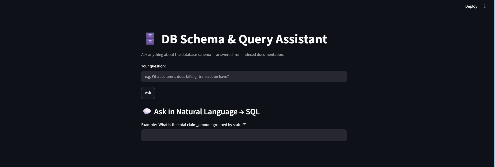

 ## Table of Contents

- [1. Problem Statement](#1-problem-statement)
- [2. Data Sources](#2-data-sources)
- [3. Architecture](#3-architecture)
- [4. Project Structure](#4-project-structure)
- [5. Technology / Tools](#5-technology--tools)
- [6. Flowing Ingestion](#6-flowing-ingestion)
- [7. Choosing Models](#7-choosing-models)
- [8. Retrieval](#8-retrieval)
- [9. How to Run](#9-how-to-run)
- [10. Evaluation Targets (optional)](#10-evaluation-targets-optional)
- [11. Monitoring Dashboard](#11-monitoring-dashboard)
- [12. Cloud Deployment (GCP — live)](#12-cloud-deployment-gcp--live)
- [13. Improvements](#13-improvements)
- [14. Evaluation Criterias](#14-evaluation-criterias)
- [15. Acknowledgments](#15-acknowledgments)
  
## 1. Problem Statement

Engineering/DBA teams often waste time hunting for schema information:
"which table stores patient insurance coverage?", "what columns does the `encounters` table have?", "where are laboratory results stored?, what is the relationship between the tables?", etc. Documentation is scattered across wikis, SQL comments, and the memory of
people who have since left the company.

This project indexes all schema documentation (DDL, table/column comments, design notes) into a vector database, then uses an LLM to answer
Natural-Language questions with relevant context — including citing the source (which table/file the answer came from).

## 2. Data Sources

Source documents: DDL files (`CREATE TABLE ...`), a `schema_notes.md` file with business-level descriptions per table, and (optionally) an `information_schema` dump from a live database. A minimal example schema of the "Healthcare Data Platform" is provided under `data/`. Other real-world source types are also supported by the ingestion pipeline — e.g. official PostgreSQL documentation pages, internal wikis, or any text/markdown knowledge base (see the "Flowing ingestion" section below).

**ER Diagram & seed data (Healthcare Data Platform example)**

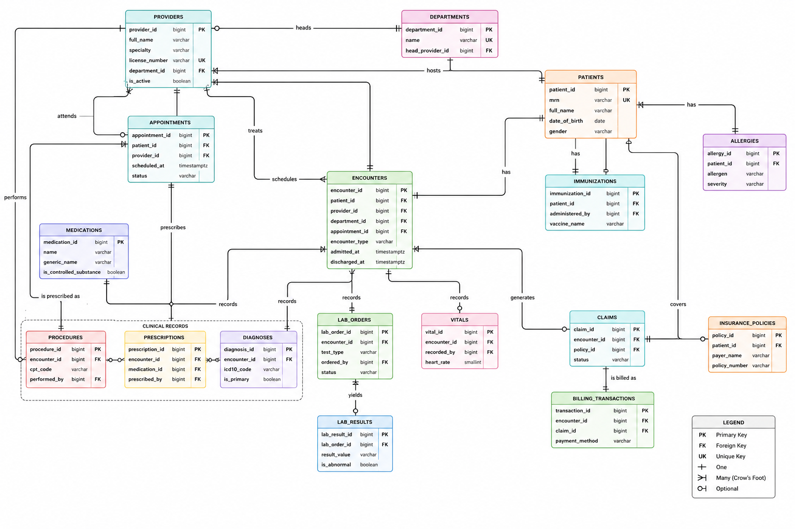

- `db/schemas.sql` — full DDL for the Healthcare 17 tables including seed data, doc_chunks and query_logs tables
- seed data — representative dummy data (166 rows across 17 tables: 10 patients, 12 encounters covering both outpatient and ER visits, insurance claims in approved/partial/rejected states, etc.).

## 3. Architecture

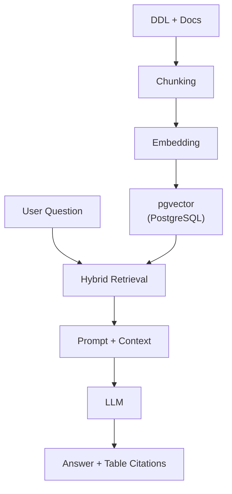

- **Ingestion**: `rag/ingestion/ingest.py` — read documents, chunk, embed, load into pgvector
- **Retrieval + Generation**: `rag/pipeline.py`
- **Evaluation**: `evaluation/evaluate.py` — retrieval hit-rate & MRR, plus LLM-as-judge for answer quality
- **UI**: `app/streamlit_app.py`

## 4. Project Structure

```
db-rag-assistant
    |   .dockerignore
    |   .env
    |   .env.cloud
    |   .env.example
    |   .env.local
    |   .gitignore
    |   curl-kestra-flows-powershell.cmd              # Windows powershell code for copy flow files to kestra
    |   curl-kestra-flows.cmd                         # Windows CMD code for copy flow files to kestra
    |   curl-kestra-flows.sh                          # Linux Shell code for copy flow files to kestra
    |   docker-compose.yml                            # Docker Compose simplifies the management of multi-container applications
    |   docker-start.cmd                              # Windows CMD code for start docker containers
    |   docker-stop.cmd                               # Windows CMD code for stop docker containers                                    
    |   Dockerfile                                    # Instructions that Docker uses to build a container image automatically
    |   Dockerfile.kestra                             # Dockerfile Kestra service
    |   README.md                                     # Explains the project does
    |   requirements.txt                              # List all the dependencies (packages and libraries) required for the project to function
    |
    +---app                                               
    |       streamlit_app.py                          # DB Schema & Query Assistant UI
    |
    +---assets
    |
    +---data                                          # source documents (DDL, schema notes)
    |       add_column_comments.sql
    |       audit_enum_candidates.sql
    |       schemas_ddl.sql
    |       schema_notes.md
    |
    +---db                                            # dock_chunks, query_logs and vector store tables for the RAG app
    |   |   doc_chunks.sql
    |   |   query_logs.sql
    |   |   schema.sql
    |
    +---evaluation
    |       evaluate.py                               # Evaluation suite for both retrieval and generation.
    |       eval_questions.json                       # json file example for evaluation
    |
    +---infra
    |   \---gcp                                       # Setup for Cloud deployment using Infrastructure as Code of Terraform 
    |       |   main.tf
    |       |   outputs.tf
    |       |   terraform.tfstate
    |       |   terraform.tfvars
    |       |   terraform.tfvars.example
    |       |   variables.tf
    |       |   versions.tf
    |       |
    +---kestra                                        # incremental-ingestion orchestration
    |   \---flows
     |          db_catalog_ingestion.yaml             # source-typpe=local_file
    |           local_file_ingestion.yaml             # source-typpe=db_catalog          
    |           rag_ingestion.yaml                    # source-typpe=local_file & db_catalog in one flow
    |
    +---notebooks                                          
    |       db_rag_assistant_progress_test.ipynb      # notebook codes for testing
    |
    +---rag
        |   config.py                                 # configuration file    
        |   generation.py                             # build a prompt from retrieval results and call the LLM
        |   load_db_catalog.py                        # loading source-type=db_catalog into doc_chunks table
        |   nl2sql-cloud.py                           # nl2sql (Cloud OpenAI platform such as Grok)
        |   nl2sql-local.py                           # nl2sql (Ollama platform open-source)
        |   nl2sql.py                                 # Natural Language -> SQL: retrieval, guardrails, read-only execution
        |   pipeline.py                               # End-to-end RAG pipeline: retrieval -> generation
        |
        +---ingestion
        |       ingest.py                             # incremental chunking + embedding + pgvector/db_catalog load
        |
        +---monitoring                                          
        |       logger.py                             # Logging helpers for the monitoring dashboard
        |       monitoring_dashboard.py               # query volume, latency, and feedback across all assistants, read from query_logs
        |
        +---retrievalpipe
                retrieval.py                          # hybrid search (semantic+keyword) plus a cross-encoder re-ranking stage on top of it

```

## 5. Technology / Tools

| Tool | Role in this project |
|---|---|
| **PostgreSQL + [pgvector](https://github.com/pgvector/pgvector)** | Vector store for document embeddings (`doc_chunks`) and the application's own operational data (`query_logs`) — one database, no separate vector DB needed |
| **[sentence-transformers](https://www.sbert.net/)** (`all-MiniLM-L6-v2`) | Local, free embedding model for semantic search — no external embedding API required |
| **PostgreSQL full-text search (`tsvector`/`ts_rank`)** | Keyword-based half of hybrid search, fused with semantic search via reciprocal rank fusion |
| **LLM via OpenAI-compatible API** ([Ollama](https://ollama.com) locally, or OpenAI/Groq/etc.) | Answer generation (Schema Assistant) and SQL generation (NL2SQL); swappable via `OPENAI_BASE_URL` with no code changes |
| **[Streamlit](https://streamlit.io)** | UI for both assistants, plus the monitoring dashboard — three views: Q&A chat, NL2SQL, and analytics |
| **Docker + Docker Compose** | Full containerization — `db`, `app`, `monitoring`, `ai_ollama`, `llm-postgres`, `kestra` and `kestra-postgres` services, one command to run everything |
| **[Kestra](https://kestra.io)** | Orchestrates incremental ingestion on a schedule or via webhook (see `kestra/flows/`) |
| **pandas** | Data wrangling for the monitoring dashboard and evaluation scripts |
| **psycopg2** | Direct PostgreSQL access for ingestion, retrieval, logging, and NL2SQL query execution |
| **Terraform** | Infrastructure-as-code for cloud deployment (GCP) - see [Ch 12. Cloud Deployment](#12-cloud-deployment-gcp--live)

## 6. Flowing Ingestion 
Flowing ingestion are incremental, not one-shot.

The naive version of `ingest.py` would `TRUNCATE` and reload everything on every run — fine for a demo, unrealistic for documentation that keeps
changing. The current version is **incremental**:

- Each chunk is hashed (`content_hash`); if the hash matches what's already   stored, the chunk is **skipped** (no re-embedding → saves API/compute cost).
- New or changed chunks are **upserted** (`ON CONFLICT ... DO UPDATE`).
- Chunks that no longer exist in the source document (trimmed/revised) are   automatically **deleted** from the index.

This makes `ingest.py` safe to call repeatedly from an orchestrator without rebuilding the whole index from scratch every time.

### Ingesting local_file 
Inside app service (container: db-rag-app)
- Source: /app/data
- source-type=local_file
- Command:
  ```
  python /app/rag/ingestion/ingest.py --source /app/data --source-type local_file
  ```

### Ingesting db_catalog
source-type=db_catalog
Besides local files, `ingest.py` also supports introspecting a real
PostgreSQL database's `information_schema` and `pg_catalog` directly — no
manual `schema_notes.md` needed. It auto-generates one chunk per table:
columns, data types, PK/FK relationships, nullability, and any
`COMMENT ON TABLE`/`COMMENT ON COLUMN` text already set on that database.
(see `db/schemas.sql` for an example schema with such comments).

Command:

```
python /app/rag/ingestion/ingest.py --source "host=db port=5432 dbname=postgres user=postgres password=postgres" --source-type db_catalog
```

The `--source` value is a standard libpq connection string pointing at the database you want documented (it can be a different database/schema
than the one storing `doc_chunks`). Running this against the Healthcare Data Platform example (after loading `db/healthcare_ddl.sql`) would index all 17 tables automatically, keeping documentation in sync with the actual schema — no drift between docs and reality. Like `local_file`,
it's incremental: only tables whose structure changed get re-embedded.

### Ingesting with Kestra Orchestrator

Kestra (and its own backend Postgres, `kestra-postgres`) run as services in `docker-compose.yml`, on the same `zoomcamp_net` network as everything else. 

The flows at:

1. Flow ID of **local_file_ingestion** executing source-ty=e=local_file
2. Flow ID of **db_catalog_ingestion** executing source-type=db_catalog
3. Flow ID of **rag_ingestion** executing both local_file and db_catalog
4. Dual triggers: **scheduled** (hourly cron) and **on-demand** via webhook
   (call it right after editing `/app/data/` or the target schema)
5. Logs a failure message if any task fails (visible in the Kestra UI)

## 7. Choosing Models

The generation step uses the OpenAI SDK, which also works against any OpenAI-compatible server including [Ollama](https://ollama.com).

### Local Model
1. An Ollama running under docker
2. Determining the model. You can use gemma3:4 model for this time.
3. Install a model: `ollama pull gemma3:4b`
Several Ollama models were pulled and tested against this project's actual questions, comparing response quality and latency side-by-side on the [monitoring dashboard](#monitoring-dashboard) (`response_time_s` per model, plus manually reviewing `answer` in `query_logs`).

The following models have already been used and tested.
```
NAME                     ID              SIZE
llama3:8b                365c0bd3c000    4.7 GB    
ministral-3:3b           f04aa1c738f6    3.0 GB   
qwen3:8b                 500a1f067a9f    5.2 GB 
gemma3:4b                a2af6cc3eb7f    3.3 GB
```
Default model: **gemma3:4b** model.

4. In .env file, set:
```
OPENAI_API_KEY=ollama
OPENAI_BASE_URL=http://ai_ollama:11434/v1  
LLM_MODEL=gemma3:4b
#LLM_MODEL=qwen3:8b
#LLM_MODEL=ministral-3:3b
#LLM_MODEL=gemma3:4b
```

### Cloud Model
1. Choose free cloud model interface such is Groq [Goq](https://grok.com/)
2. Get API Key: [Groq API Key](https://console.groq.com/keys)
3. Use the **qwen/qwen3.6-27b** model
4. Setup .env file
```
OPENAI_API_KEY=<your API Key>
OPENAI_BASE_URL="https://api.groq.com/openai/v1"
LLM_MODEL="qwen/qwen3.6-27b" 
```
 
 *Notes:*
 - By default .env file is for local model
 - I prepare three .env files namely: `.env`, `.env.local` & `.env.cloud`
 - You can copy `.env.cloud` to `.env` if you want to use cloud model. Set API_Key and model parameters on .env file.
   
## 8. Retrieval
--> exact table match + hybrid search + optional re-ranking

Retrieval is intentionally optimized for a small database-schema corpus:

1. **Exact table-name match** — questions that explicitly mention a table (for example, `patients`) bypass semantic search and re-ranking and read that table's indexed chunks directly.
2. **Hybrid search** — semantic pgvector search and PostgreSQL full-text search are fused with reciprocal-rank fusion.
3. **Optional cross-encoder re-ranking** — controlled by `ENABLE_RERANKER`; keep it `false` on CPU when latency matters.

The application also reuses the embedding model and a PostgreSQL connection pool. 
For Ollama/Qwen3, `LLM_REASONING_EFFORT=none` disables the extra thinking pass, while `LLM_MAX_TOKENS` bounds output length. These settings are important for keeping a schema assistant responsive on CPU-only hardware.

The repository includes 116 healthcare-specific retrieval evaluation questions in `evaluation/eval_questions.json`, covering all 17 healthcare tables and both direct and conceptual retrieval cases.

## 9. How to run

**Using Docker Compose**

### Platform (Host): Windows**

Pre-requites:
- python
- git
- Docker Dekstop (Windows)

#### STEPS

1. Open (Start) Windows Docker Desktop 

2. Clone repository
   ```
   cd
   git clone https://github.com/ketut-garjita/db-rag-assistant.git
   ```
3. Goto the repository home directory

   ```
   cd db-rag-assistant.git
   ```
4. Execute docker compose

   ```
   docker compose up -d --build
   ```
   
5. Review all (7) containers running
   ```
   docker ps
   ```
   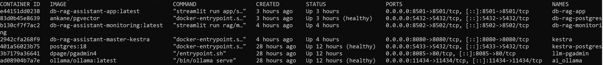

   
    If there are any containers that are not running, execute the command below:

   ```
   docker-start.cmd
   ```
   
   *Note:*
   First time the Postgres volume is initialized, the 17 table of "Healthcare Data Platform" tables automatically created and populated from `db/schema.sql`. In addition, `doc_chunks` and `query_logs` tables also created.
   
   
6. Install model
   ```
   docker exec ai_ollama ollama list
   docker exec ai_ollama ollama pull gemma3:4b
   docker exec ai_ollama ollama list
   ```
7. Ingest local file
    ```
    docker exec db-rag-app python /app/rag/ingestion/ingest.py --source /app/data --source-type local_file
    ```
    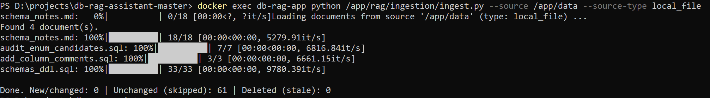
   
8. Ingest db catalog
   ```
   docker exec db-rag-app python /app/rag/ingestion/ingest.py --source "host=db port=5432 dbname=postgres user=postgres password=postgres" --source-type db_catalog
   ```
    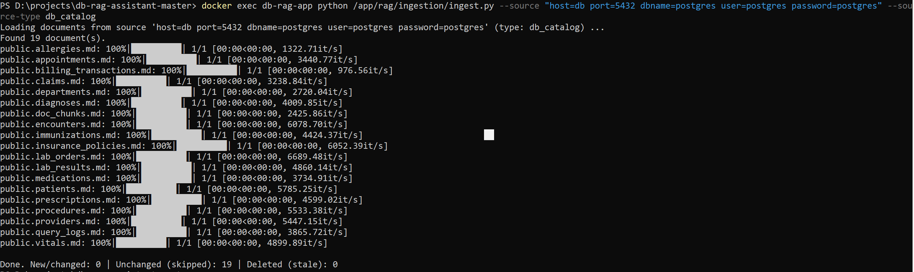
   
9. If using local model, use an existing `.env` file (default). The rag/nl2sql.py no changes.
10. If using cloud model change `.env` with `.env.cloud` and `rag/nl2sql.py` with `rag/nl2sql.cloud.py`
   
   ```
   copy .env.cloud .env
   copy rag/nl2sql-cloud.py rag/.nl2sql.py
   ```
   
   Provide API_Key and model on .env file.

   *Note:*
   If you want to switch using local model:
   
   ```   
   copy .env.local .env
   copy rag/nl2sql-local.py rag/nl2sql.py
   ```
   
11. Restart app (dag-rag-assistant-app)

    ```
    docker compose down app
    docker compose up -d app
    ```

12. Check docker containers
    ```
    docker ps
    ```

13. Open the Streamlit App UI at [http://localhost:8501](http://localhost:8501)
   
    
   
14. Type questions below one-by-one

    After answered klick feedback (👍 or 👎)

    DB Schema (Your Question): --> Klick Ask to execute
    ```
    1. What columns does patients have?
    2. Which table stores hospital units such as Cardiology and Radiology?
    3. What is the relationship between the patient and billing?
    ```
    Ask in Natural Language --> SQL: --> type [Enter] to execute
    ```
    1. What is the total claim_amount grouped by status?
    2. Which insurance_policy has the highest total approved claims?
    3. How many claims does each insurance policy name have?
    ``` 
    ### Local Model Responses

    
    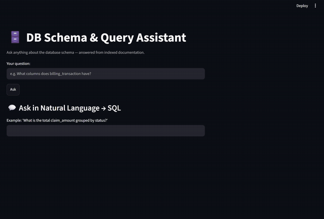 

    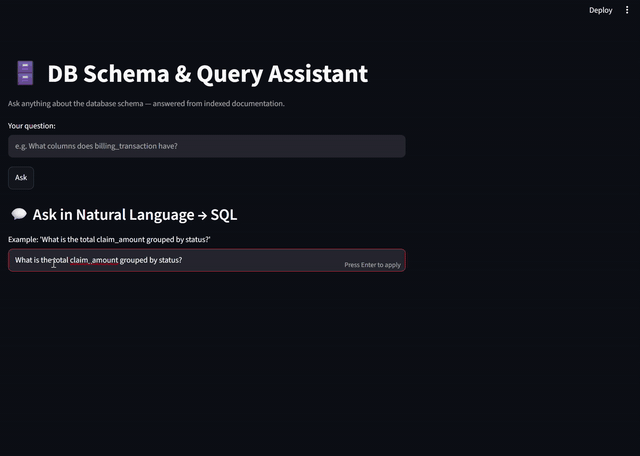


    ### Cloud Model Responses

    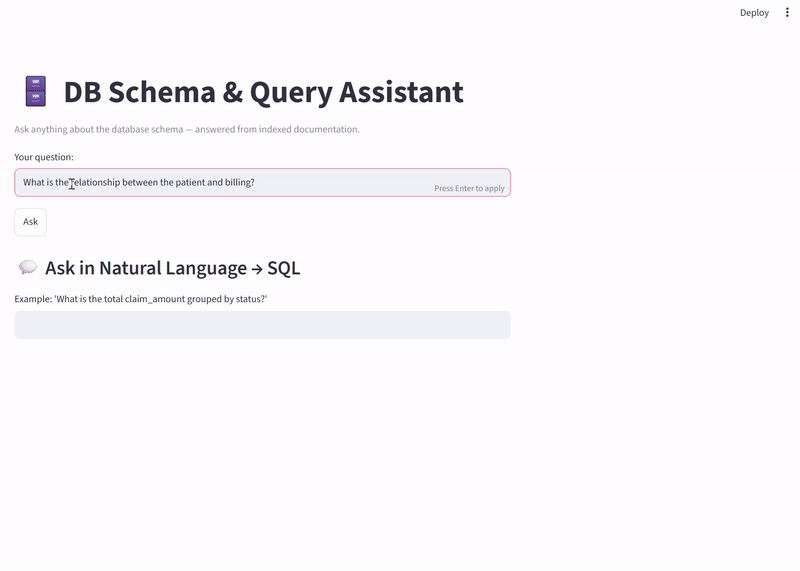 

    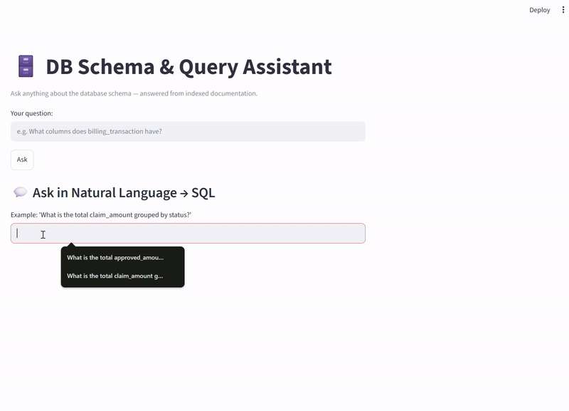

    
15. Monitoring Dashborad

    Open [http://localhost:8502](http://localhost:8502)

    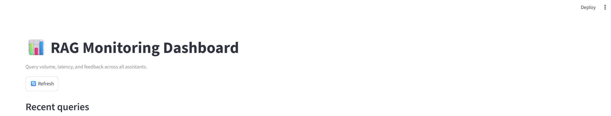
    
16. For next data ingestion via Kestra Orchestrator, follow steps below:
    - **Copy flow files from host to kestra using PowerShell**.

        Use copy & paste the codes.
        ```
        curl.exe -v `
          -u 'admin@kestra.io:Admin1234$' `
          -X POST 'http://localhost:8080/api/v1/main/flows' `
          -H 'Content-Type: application/x-yaml' `
          --data-binary '@./kestra/flows/local_file_ingestion.yaml'
        
        curl.exe -v `
          -u 'admin@kestra.io:Admin1234$' `
          -X POST 'http://localhost:8080/api/v1/main/flows' `
          -H 'Content-Type: application/x-yaml' `
          --data-binary '@./kestra/flows/db_catalog_ingestion.yaml'
        	
        curl.exe -v `
          -u 'admin@kestra.io:Admin1234$' `
          -X POST 'http://localhost:8080/api/v1/main/flows' `
          -H 'Content-Type: application/x-yaml' `
          --data-binary '@./kestra/flows/rag_ingestion.yaml'
        ```
        OR execute script below:
    
        Using CMD command:

        ```
        curl-kestra-flows.cmd
        ```
        Using PowerShell command:
    
        ```
        curl-kestra-flows-powershell.cmd
        ```
    
    - **Open Kestra UI at** [http://localhost:8080](http://localhost:8080)
      ```
        Username: admin@kestra.io
        Password: Admin1234$
      ```
    
    
    - **Execute**
      ```
      Flows --> rag_ingestion --> Execute
      ```
      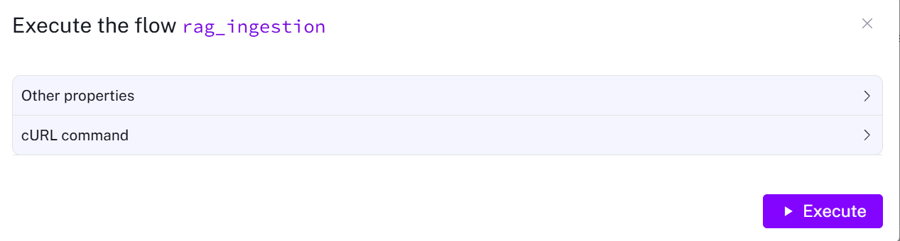
    
    - **Review Gantt (result)**
      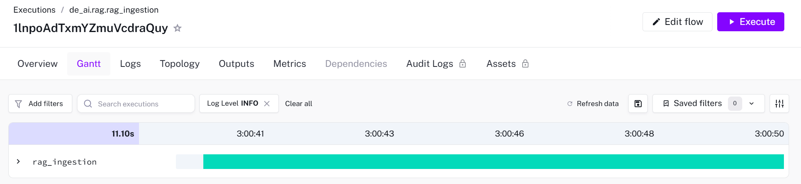
   
      Note: Ingestion SUCCESS. Ignore the error below it.
   
      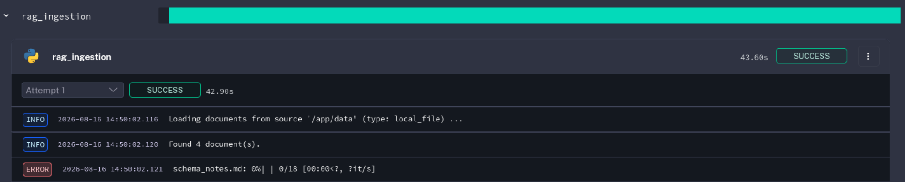
        
        *Note:*
    
           Another way to create kestra flow:
            - Goto to the menu Flows --> +Create
            - In other session, open the `kestra/flows/rag_ingestion.yaml` file using Notepad editor    
            - Copy & paste the content into Kestra Flows Editor
            - Save
            - Execute
    
17. Make ingestion trigger running hourly --> Press the Topology menu.    

     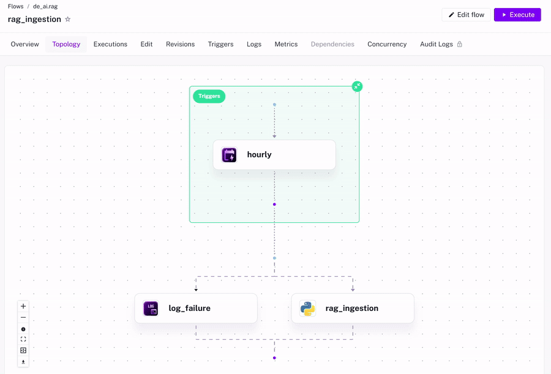 
    

### Running on Virtual Machine (VM)
If you wish to use a Virtual Machine (VM) as the host, follow the same steps outlined above, ensuring that:
- Python, Git, Docker and Docker Compose have been installed.
- Execute the following script (bash command) to copy the flow files from the host to Kestra:
  ```
  bash curl-kestra-flows.sh
  ```
- No need to install Ollama
- Rename file of docker-compose-without-ollama.yml to docker-compose.yml
  ```
  mv docker-compose-without-ollama.yml docker-compose.yml

- **Use only Cloud Model**

- Follow steps 2 - 17 
  
    
## 10. Evaluation Targets (optional)

Run with:

cd to the project HOME directory
```
docker compose exec app python evaluation/evaluate.py`
```
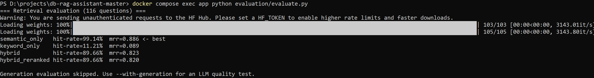

- **Retrieval**: hit-rate and Mean Reciprocal Rank (MRR), compared across
  three approaches (semantic-only, keyword-only, hybrid) — the script
  reports the best one, which is what `rag/retrieval/retrieval.py` actually uses
- **Generation**: two system-prompt variants compared via LLM-as-judge
  (1-5 relevance score) — the better-scoring prompt is the one shipped in
  `rag/generation.py`
- **Monitoring**: log queries, response time, and user feedback (👍/👎) from the UI

## 11. Monitoring Dashboard

Every question asked in `app/streamlit_app.py` is logged to the
`query_logs` table (question, answer/sources, response time, and 👍/👎
feedback) via `monitoring/logger.py`. A separate Streamlit page reads
that table and renders **5 charts** — query volume per day, queries by
assistant, avg latency by assistant, feedback breakdown, and a daily
latency trend line — plus top-level metrics (total queries, avg latency,
helpful rate) and a table of recent queries.

`nl2sql.py` (the "Natural Language to SQL" assistant) is already wired
up to log to the same table under `app_name = "NL2SQL"`, alongside the
DB Schema Assistant's `"schema_qa"` — both show up on one dashboard with
no extra setup. If you use a binary 1/0 feedback signal in the NL2SQL UI
(e.g. from a legacy `nl2sql_feedback`-style table), use the
`feedback_from_int()` wrapper instead of `update_feedback()` so it maps
onto the same `'up'`/`'down'` values transparently:

### Dashboard Examples

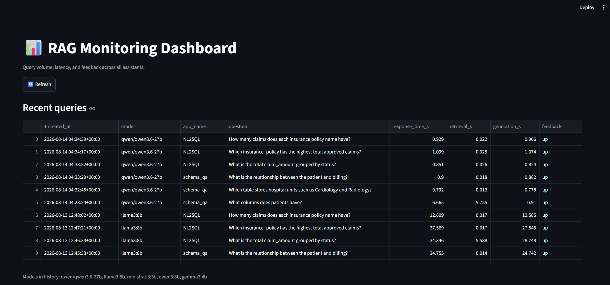
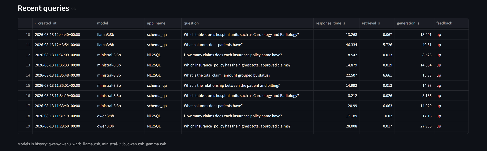
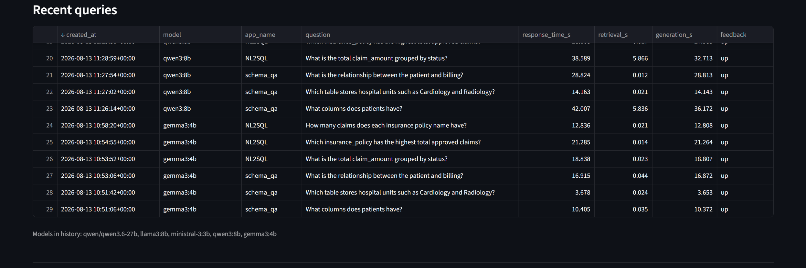
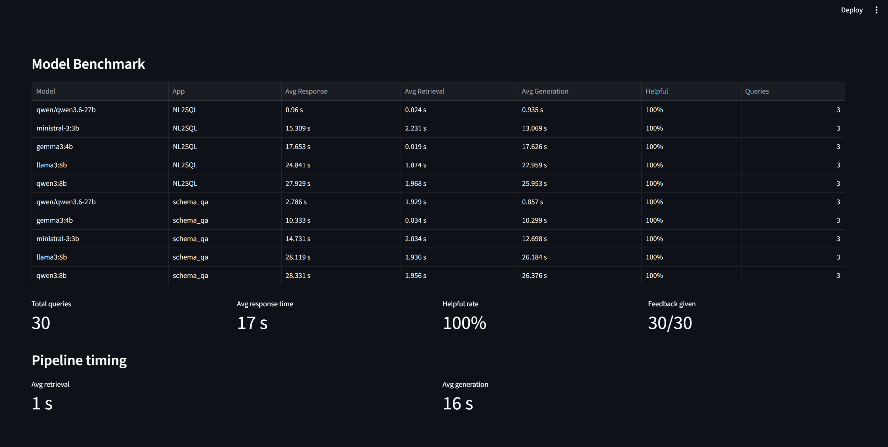
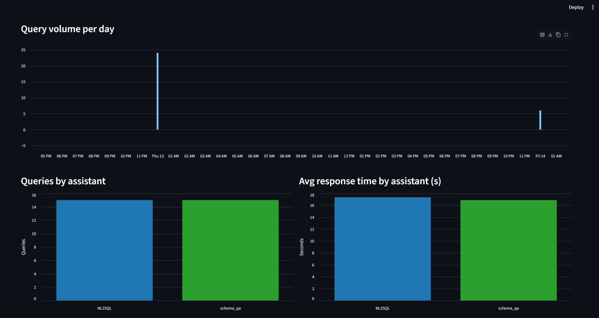
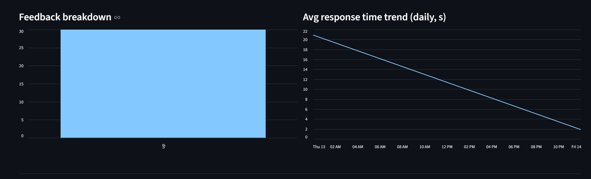

## 12. Cloud Deployment (GCP — live)

Deployed and verified working on Google Cloud via Terraform (`infra/gcp/`):
**Cloud Run** (`db-rag-app` + `db-rag-monitoring`, mirroring the two
Streamlit services in `docker-compose.yml`), **Cloud SQL for PostgreSQL**
(pgvector extension, region `asia-southeast2`), **Artifact Registry**,
and **Secret Manager** for credentials. The LLM provider is
[Groq](https://groq.com) (OpenAI-compatible endpoint, model
`qwen/qwen3.6-27b`) rather than a locally-hosted model — see
"Design decisions" below for why.

`ollama`, `pgadmin`, and `kestra` are intentionally **not** reproduced in
this cloud deployment — see "Design decisions" below.

#### Steps

1. Install the [Google Cloud CLI](https://cloud.google.com/sdk/docs/install)
   and Terraform ≥ 1.5.
2. Authenticate — **two separate logins are required**, for two different
   consumers of your Google credentials:
   ```bash
   gcloud auth login                          # for the gcloud CLI / docker push
   gcloud auth application-default login      # for Terraform's google provider
   gcloud config set project <project_id>
   ```
3. `cd infra/gcp && cp terraform.tfvars.example terraform.tfvars`, fill in
   real values (never commit this file — it's in `.gitignore`). Set
   `region` to wherever you want to deploy (`asia-southeast2` / Jakarta is
   confirmed to support every service this project uses).
4. Create the Artifact Registry repo first — you need it to exist before
   you can push an image to it:
   ```bash
   terraform init
   terraform apply -target=google_artifact_registry_repository.repo
   ```
5. Build and push the image (from the **repo root**, where the
   `Dockerfile` is — not from `infra/gcp/`):
   ```bash
   gcloud auth configure-docker <region>-docker.pkg.dev
   docker build -t <region>-docker.pkg.dev/<project_id>/db-rag-assistant/app:latest .
   docker push <region>-docker.pkg.dev/<project_id>/db-rag-assistant/app:latest
   ```
   Put that exact URI in `terraform.tfvars` as `app_image_tag`. If you're
   using Groq (or any non-OpenAI provider), also set `openai_base_url` in
   `terraform.tfvars` (e.g. `"https://api.groq.com/openai/v1"`) — leaving
   it unset makes the app call real OpenAI, which will reject a key from
   any other provider.
6. `terraform apply` again to create everything else (Cloud SQL, secrets,
   both Cloud Run services).
7. **Initialize the Cloud SQL schema** (Terraform provisions the instance
   but doesn't run SQL against it):
   ```bash
   gcloud sql connect db-rag-postgres --user=postgres
   # then, in psql:
   \i db/schema.sql
   ```
8. **Populate `doc_chunks`.** Cloud Run has no `docker exec` — run
   ingestion locally against the Cloud SQL instance through the Cloud SQL
   Auth Proxy instead:
   ```bash
   # terminal 1 -- leave running
   cloud-sql-proxy <project_id>:<region>:db-rag-postgres --port 5433

   # terminal 2
   docker run --rm \
     -e PG_HOST=host.docker.internal -e PG_PORT=5433 \
     -e PG_DB=postgres -e PG_USER=postgres -e PG_PASSWORD=<db_password> \
     -e OPENAI_API_KEY=<key> -e OPENAI_BASE_URL=<base_url> -e LLM_MODEL=<model> \
     <region>-docker.pkg.dev/<project_id>/db-rag-assistant/app:latest \
     python /app/rag/ingestion/ingest.py --source /app/data --source-type local_file

   docker run --rm \
     -e PG_HOST=host.docker.internal -e PG_PORT=5433 \
     -e PG_DB=postgres -e PG_USER=postgres -e PG_PASSWORD=<db_password> \
     -e OPENAI_API_KEY=<key> -e OPENAI_BASE_URL=<base_url> -e LLM_MODEL=<model> \
     <region>-docker.pkg.dev/<project_id>/db-rag-assistant/app:latest \
     python /app/rag/ingestion/ingest.py \
       --source "host=host.docker.internal port=5433 dbname=postgres user=postgres password=<db_password>" \
       --source-type db_catalog
   ```
   (Port 5433 rather than Postgres's default 5432 — see troubleshooting
   below for why.)
9. `terraform output` for the app and monitoring URLs.

#### Design Decisions
See [Cloud Design Decision](infra/gcp/doc/cloud-design-decisions.md)


#### Troubleshooting log
Real issues hit (and fixed) getting this deployment working, in case you hit the same ones see [gcp-deployment-troubleshooting](infra/gcp/doc/gcp-deployment-troubleshooting.md).

#### Screenshoot

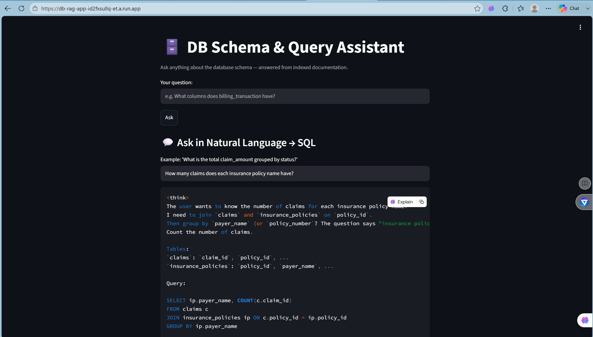

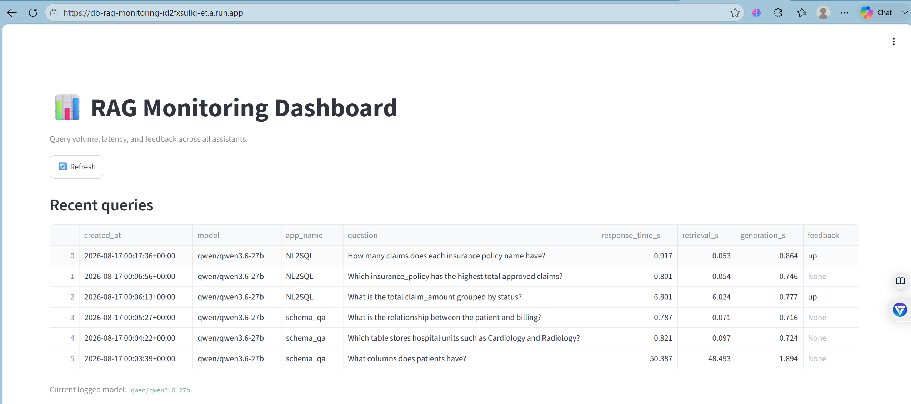

See other screenshoots: [GCP Screenshoots](infra/gcp/doc/gcp-screenshoots.md)

## 13. Improvements

Other improvements:
- Alerting on the monitoring dashboard (e.g. Slack ping when helpful rate drops below a threshold, or latency spikes)
- Swap the Streamlit dashboard for Grafana if you need longer retention, alert rules, or multi-user access control


## 14. Evaluation Criterias

Self-assessed against the course rubric, with pointers to where each
criterion is satisfied in this repo. Update the ✅/⚠️/❌ marks and notes as
the project evolves — this table is meant to be kept honest, not just
maximized.

| Criterion | Status | Where / notes |
|---|---|---|
| Problem description | ✅ | [Problem statement](#problem-statement) above — the doc-fragmentation problem and how RAG solves it |
| Retrieval flow | ✅ | Knowledge base (`doc_chunks` in pgvector) + LLM both used — `rag/pipeline.py`, `nl2sql.py` |
| Retrieval evaluation | ✅ | `evaluation/evaluate.py` compares **5 approaches** (semantic-only, keyword-only, hybrid, hybrid+reranked, hybrid+reranked+query-rewriting) on hit-rate/MRR; the winner is used in production (`rag/pipeline.py`) |
| LLM evaluation | ✅ | `evaluation/evaluate.py` compares **2 system-prompt variants** via LLM-as-judge (1-5 relevance score); the better-scoring prompt is the one shipped in `rag/generation.py` |
| Interface | ✅ | Streamlit UI — `app/streamlit_app.py` (both assistants) |
| Ingestion pipeline | ✅ | Incremental, hash-based ingestion (`ingestion/ingest.py`), automated via Kestra — `kestra` + `kestra-postgres` run in `docker-compose.yml`, flow at `kestra/flows/db_rag_ingestion.yml` imported and run in the Kestra UI |
| Monitoring | ✅ | Feedback (👍/👎 → `query_logs.feedback`) + dashboard with **5 charts** (`app/monitoring_dashboard.py`): daily volume, queries by assistant, avg latency by assistant, feedback breakdown, latency trend |
| Containerization | ✅ | Everything in `docker-compose.yml` — `db`, `app`, `monitoring` |
| Reproducibility | ✅ | README instructions are complete, the code works end-to-end, and requirements.txt is pinned |
| **Best practices**  | |
| — Hybrid search | ✅ | `rag/retrieval.py` `hybrid_search()` — semantic + keyword, fused and evaluated |
| — Document re-ranking | ✅ | `rag/retrieval.py` `hybrid_search_reranked()` — cross-encoder (`ms-marco-MiniLM-L-6-v2`) re-scores a wider candidate pool; evaluated against plain hybrid in `evaluate.py` and used in production |
| — Query rewriting | ✅ | `rag/retrieval.py` `rewrite_query()` — one LLM call reformulates the question before retrieval; toggle via `ENABLE_QUERY_REWRITING` in `.env`, evaluated on/off in `evaluate.py` |
| **Bonus** | | | |
| Cloud deployment | ✅ | Deployed and verified working on GCP (Cloud Run + Cloud SQL + Artifact Registry + Secret Manager) via Terraform — see [Cloud deployment](#cloud-deployment-gcp--live), including a troubleshooting log of every real issue hit along the way |
| Extra bonus (up to 3) |✅ | Candidates worth flagging to reviewers: live-schema ingestion straight from `information_schema` (`db_catalog` source, no manual docs needed), a second full example schema (Healthcare Data Platform, 17 tables) with ER diagram + seed data, unified monitoring across two independently-built assistants, local-LLM support via Ollama with zero code changes |

## 15. Acknowledgments

• DataTalks.Club Community — for fostering a vibrant and collaborative learning environment in LLM Zoomcamp.