# DB Schema & Query Assistant

An evaluation-driven **Retrieval-Augmented Generation (RAG) system for database knowledge and natural-language querying**.

The system transforms database documentation and metadata into a searchable knowledge base, allowing users to ask questions about table schemas, column descriptions, relationships, and operational notes in natural language. It also provides a **Natural Language → SQL** workflow that retrieves relevant schema context, generates a single SQL statement, validates it for read-only execution, and executes it against PostgreSQL.

The project uses **PostgreSQL + pgvector** as the knowledge store and follows the learning foundation of the **DataTalksClub LLM Zoomcamp**. It extends the course concepts into an end-to-end AI application covering ingestion, embeddings, retrieval, generation, NL2SQL safety controls, evaluation, monitoring, orchestration, and Google Cloud deployment.

---
## Executive Summary

Engineering and DBA teams frequently spend time searching for database knowledge distributed across DDL files, table and column comments, design notes, internal documentation, and individual experience.

This project addresses that problem by creating a shared, searchable knowledge layer for database schema documentation and metadata.

The system provides two assistants:

* **DB Schema Assistant** — answers natural-language questions about database structures and documentation using retrieved context and source references.
* **Natural Language → SQL** — converts natural-language questions into validated, read-only SQL queries and executes them against PostgreSQL.

Both assistants use the same indexed knowledge base and share a common monitoring layer. The application is designed to support both local experimentation with Ollama and cloud-based generation through an OpenAI-compatible API.

The project emphasizes the complete AI application lifecycle:

```text
Ingestion
    ↓
Chunking and Embedding
    ↓
Vector Storage
    ↓
Retrieval
    ↓
Generation
    ↓
Validation / Execution
    ↓
Evaluation
    ↓
Monitoring
    ↓
Deployment
```

The goal is not only to demonstrate a working RAG application, but also to explore the engineering considerations required to make an AI system measurable, repeatable, observable, and safer to operate.

---
## Architecture Diagram

The system separates source-data ingestion, searchable knowledge storage, assistant workflows, and runtime monitoring.

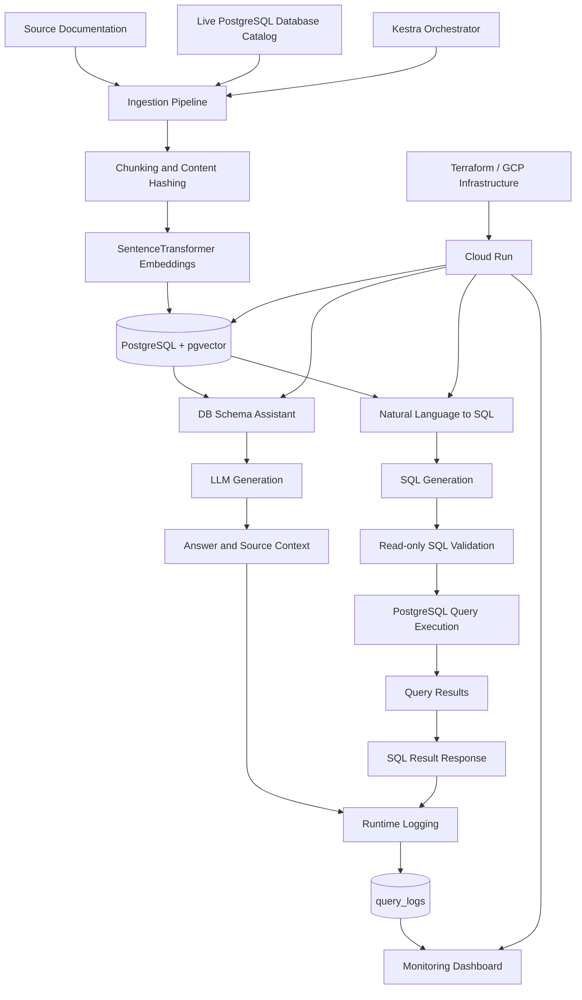

**Main Architectural Components**

| Component             | Responsibility                                                                                     |
| --------------------- | -------------------------------------------------------------------------------------------------- |
| Source documents      | DDL, Markdown notes, schema descriptions, and other supported text-based documentation             |
| PostgreSQL catalog    | Provides schema metadata from a live database                                                      |
| Ingestion pipeline    | Reads sources, chunks content, detects changes, creates embeddings, and updates the knowledge base |
| PostgreSQL + pgvector | Stores searchable document chunks and vector embeddings                                            |
| DB Schema Assistant   | Performs natural-language question answering over retrieved documentation                          |
| NL2SQL workflow       | Retrieves schema context, generates SQL, validates it, and executes read-only queries              |
| LLM provider          | Generates natural-language answers or SQL through a configurable OpenAI-compatible interface       |
| `query_logs`          | Stores runtime query information, timing data, model information, and user feedback                |
| Monitoring dashboard  | Provides visibility into usage, latency, assistant type, and feedback                              |
| Kestra                | Orchestrates repeatable and scheduled ingestion workflows                                          |
| Terraform / GCP       | Defines and provisions the cloud infrastructure                                                    |

---
## Engineering Focus

The project emphasizes the complete AI application lifecycle rather than only LLM prompting:

**Ingestion → Embedding → Retrieval → Generation → Validation → Execution → Evaluation → Monitoring → Deployment**

Key engineering areas include:

* Incremental document and database-catalog ingestion
* Semantic retrieval using **SentenceTransformers + pgvector**
* PostgreSQL full-text search and configurable hybrid retrieval
* Optional cross-encoder reranking
* Retrieval evaluation using **Hit Rate and MRR**
* Schema-aware NL2SQL generation
* Read-only SQL validation and automatic query limits
* Query and user-feedback logging
* Monitoring dashboards for latency, usage, and feedback
* Kestra-based ingestion orchestration
* Terraform-based deployment to **Google Cloud Platform**
* Cloud Run, Cloud SQL, Artifact Registry, and Secret Manager integration

The system is designed as a **portfolio-grade LLM Engineering project**, with an emphasis on measurable retrieval quality, safety, observability, reproducibility, and operational considerations.
 
---
## Key Capabilities

### Knowledge Ingestion

* Incremental ingestion rather than full index reconstruction.
* Content-hash-based change detection.
* Re-embedding only for new or modified chunks.
* Upsert of changed content using PostgreSQL conflict handling.
* Removal of stale chunks that no longer exist in the source.
* Support for local text and Markdown-based documentation.
* PostgreSQL database-catalog ingestion from live schema metadata.

### Retrieval-Augmented Generation

* Semantic retrieval using SentenceTransformers embeddings and pgvector.
* Optional PostgreSQL full-text search.
* Configurable hybrid retrieval using reciprocal rank fusion.
* Optional cross-encoder reranking.
* Exact table-name retrieval when a question explicitly identifies a table.
* Source-aware context construction for schema and documentation questions.

### Database Schema Assistant

* Natural-language questions about tables, columns, data types, and relationships.
* Retrieval over DDL, schema notes, comments, and database catalog metadata.
* Answers grounded in indexed documentation.
* Source context identifying the relevant table or document.

### Natural Language → SQL

* Natural-language questions converted into SQL.
* Schema context retrieved from indexed `db_catalog` information.
* Generation constrained to a single SQL statement.
* Read-only SQL validation.
* Automatic query limiting where applicable.
* Execution through PostgreSQL.
* Query results returned to the user.
* Runtime query logging and feedback capture.

### Evaluation

* Retrieval evaluation using **Hit Rate** and **Mean Reciprocal Rank (MRR)**.
* Comparison of semantic-only, keyword-only, hybrid, and hybrid-reranked retrieval.
* Generation evaluation using an LLM-as-judge workflow.
* Evaluation against project-specific questions rather than only synthetic examples.
* Measurement-driven decisions about retrieval complexity and model configuration.

### Monitoring and Observability

* Query logging for both assistants.
* Response-time tracking.
* Retrieval and generation timing information.
* Model and assistant identification.
* User feedback through thumbs-up and thumbs-down controls.
* Monitoring dashboard for usage, latency, and feedback trends.

### Model Flexibility

* Local model execution through Ollama.
* Cloud model execution through the Groq OpenAI-compatible API.
* Environment-based model switching.
* Shared application logic across local and cloud execution modes.
* Support for model experimentation using real project questions.

### Orchestration and Deployment

* Kestra workflows for local-file and database-catalog ingestion.
* Manual, scheduled, and webhook-triggered ingestion workflows.
* Docker Compose-based local development.
* Terraform-based Google Cloud infrastructure.
* Cloud Run services for the application and monitoring dashboard.
* Cloud SQL PostgreSQL deployment.
* Artifact Registry for container images.
* Secret Manager and IAM integration for cloud configuration.

---
## Quick Start ⭐⭐⭐

This quick start launches the application locally and allows you to test both assistants.

Choose one model execution mode:

* **Cloud model:** Groq API with `qwen/qwen3.8-27b`
* **Local model:** Ollama with `gemma3:4b`

### Prerequisites

Install:

* Git
* Docker
* Docker Compose
* Python

For the local-model option, Docker will also run the Ollama service.

### 1. Clone the Repository

```bash
git clone https://github.com/ketut-garjita/db-rag-assistant.git
cd db-rag-assistant
```

### 2. Choose a Model Configuration

#### Option A — Cloud Model

The cloud option uses the Groq OpenAI-compatible API.

```bash
cp docker-compose-without-ollama.yml docker-compose.yml
cp rag/nl2sql-cloud.py rag/nl2sql.py
cp .env.cloud .env
```

Open `.env` and configure the API key:

```dotenv
OPENAI_API_KEY=<your-groq-api-key>
OPENAI_BASE_URL=https://api.groq.com/openai/v1
LLM_MODEL=qwen/qwen3.8-27b
```

Do not commit `.env` or any file containing credentials.

#### Option B — Local Model with Ollama

The local option runs the LLM through Ollama in Docker.

```bash
cp docker-compose-with-ollama.yml docker-compose.yml
cp .env.local .env
cp rag/nl2sql-local.py rag/nl2sql.py
```

The local configuration uses:

```dotenv
OPENAI_API_KEY=ollama
OPENAI_BASE_URL=http://ai_ollama:11434/v1
LLM_MODEL=gemma3:4b
```

### 3. Start the Docker Compose Stack

```bash
docker compose up -d --build
```

Verify the services:

```bash
docker ps
```

For the local-model option, install the model inside the Ollama container:

```bash
docker exec ai_ollama ollama pull gemma3:4b
docker exec ai_ollama ollama list
```

On the first PostgreSQL initialization, the application creates the example Healthcare Data Platform schema together with the RAG and monitoring tables, including:

* Healthcare example tables and seed data
* `doc_chunks`
* `query_logs`

Existing PostgreSQL volumes are not automatically reinitialized.

### 4. Ingest the Knowledge Base

Run local-file ingestion:

```bash
docker exec db-rag-app \
  python /app/rag/ingestion/ingest.py \
  --source /app/data \
  --source-type local_file
```

Then ingest the PostgreSQL database catalog:

```bash
docker exec db-rag-app \
  python /app/rag/ingestion/ingest.py \
  --source "host=db port=5432 dbname=postgres user=postgres password=postgres" \
  --source-type db_catalog
```

The ingestion pipeline is incremental. Re-running these commands does not require unchanged chunks to be embedded again.

### 5. Open the Application

Open the Streamlit application:

**http://localhost:8501**

 
 
The application provides two assistants.

#### DB Schema Assistant

Try questions such as:

```text
What columns does patients have?

Which table stores hospital units such as Cardiology and Radiology?

What is the relationship between the patient and billing?
```

Click **Ask** and review the answer and source context.

#### Natural Language → SQL

Try questions such as:

```text
What is the total claim_amount grouped by status?

Which insurance_policy has the highest total approved claims?

How many claims does each insurance policy name have?
```

Press **Enter** to execute the generated SQL.

The NL2SQL workflow retrieves schema context, generates a SQL statement, validates it for read-only execution, applies query limits where required, and executes it against PostgreSQL.

After testing an answer, use the **👍 / 👎 feedback controls** to record your evaluation.

### 6. View the Monitoring Dashboard

Open:

**http://localhost:8502**

The monitoring dashboard displays runtime information collected from both assistants, including:

* Query volume
* Assistant type
* Response latency
* Model information
* Retrieval and generation timing
* User feedback

### 7. Optional — Run Kestra Ingestion

For scheduled or repeatable ingestion, deploy the Kestra flow definitions:

```bash
./scripts/deploy_kestra_flows.sh
```

Open the Kestra UI:

**http://localhost:8080**

The default credentials are intended only for local development:

```text
Username: admin@kestra.io
Password: Admin1234$
```

In the Kestra UI, execute:

```text
Flows
  → rag_ingestion
  → Execute
  → Execute
```

The `rag_ingestion` workflow can orchestrate local-file and database-catalog ingestion. It can also be configured for scheduled execution or on-demand webhook triggering.

> **Security note:** Change the default credentials before exposing Kestra outside a local development environment.

### What You Can Try

The following workflow demonstrates the complete application path:

```text
Question
   ↓
Relevant schema/documentation retrieval
   ↓
LLM-generated answer or SQL
   ↓
Validation for NL2SQL
   ↓
Read-only PostgreSQL execution
   ↓
Response / query result
   ↓
Runtime logging and feedback
```

#### Example Schema Questions

```text
What columns does patients have?

Which table contains insurance claim information?

What is the relationship between patients, encounters, and billing?

Where are laboratory results stored?
```

#### Example NL2SQL Questions

```text
What is the total claim_amount grouped by status?

Which insurance policy has the highest total approved claims?

How many claims does each insurance policy name have?

How many encounters are recorded for each patient?
```

### Expected Result

After completing the quick start, you should be able to:

* Access the Streamlit application at `http://localhost:8501`.
* Ask natural-language questions about the indexed database documentation.
* Receive answers based on retrieved schema context.
* Generate and execute validated, read-only SQL queries.
* View query results in the application.
* Submit thumbs-up or thumbs-down feedback.
* Review runtime metrics in the monitoring dashboard at `http://localhost:8502`.
* Re-run ingestion without rebuilding unchanged embeddings.
* Optionally execute ingestion workflows through Kestra at `http://localhost:8080`.

The local and cloud configurations use the same application workflow. The main difference is the LLM backend: Ollama provides local generation, while the cloud configuration uses an OpenAI-compatible hosted model API.


An evaluation-driven **Retrieval-Augmented Generation (RAG) system for database knowledge and natural-language querying**.

The system turns database documentation and metadata into a searchable knowledge base, allowing users to ask questions about table schemas, column descriptions, relationships, and operational notes in natural language. It also provides a **Natural Language → SQL** workflow that retrieves relevant database schema context, generates a single SQL statement, validates it for read-only execution, and executes it against PostgreSQL.

The project is built with **PostgreSQL + pgvector** as the knowledge store and follows the learning foundation of the **DataTalksClub LLM Zoomcamp**, while extending the coursework into a practical end-to-end AI application with retrieval evaluation, NL2SQL safety controls, monitoring, orchestration, and GCP deployment.

 ## Table of Contents

- [1. Problem Statement](#1-problem-statement)
- [2. Data Sources](#2-data-sources)
- [3. Architecture](#3-architecture)
- [4. Project Structure](#4-project-structure)
- [5. Technology / Tools](#5-technology--tools)
- [6. Flowing Ingestion](#6-flowing-ingestion)
- [7. Choosing Models](#7-choosing-models)
- [8. Retrieval](#8-retrieval)
- [9. How to Run](#9-how-to-run)
- [10. Evaluation Targets](#10-evaluation-targets-optional)
- [11. Monitoring Dashboard](#11-monitoring-dashboard)
- [12. Cloud Deployment (GCP — live)](#12-cloud-deployment-gcp--live)
- [13. Improvements](#13-improvements)
- [14. Evaluation Criterias](#14-evaluation-criterias)
- [15. Acknowledgments](#15-acknowledgments)

---

## 1. Problem Statement

Engineering and DBA teams often spend significant time searching for database schema information that is fragmented across DDL files, table and column comments, design notes, internal documentation, and tribal knowledge.

Typical questions are simple but costly to answer manually:

* Which table stores patient insurance coverage?
* What columns are available in the `encounters` table?
* Where are laboratory results stored?
* How are the relevant tables related?
* Which tables and columns should be used to answer a particular business question?

As database environments evolve, this knowledge can become increasingly difficult to discover, maintain, and reuse. The problem is not only finding the schema definition itself, but also connecting a natural-language question with the relevant database context.

This project addresses that problem by creating a searchable knowledge layer over database schema documentation and metadata. Documentation such as DDL, table and column comments, and design notes is incrementally indexed and made available to an LLM through retrieval-augmented generation (RAG).

The system provides two complementary capabilities:

1. **DB Schema Assistant** — answers natural-language questions using retrieved database documentation and provides the relevant source context.
2. **Natural Language → SQL** — uses retrieved database schema context to generate a single SQL query, validates it for read-only execution, and executes it against PostgreSQL.

The objective is to reduce the effort required to discover database knowledge while keeping responses grounded in the indexed schema context and applying safety controls to generated SQL.

---

## 2. Data Sources

The project uses a small **Healthcare Data Platform** as its reference database domain. The example is intentionally domain-specific enough to demonstrate schema discovery, table relationships, and natural-language querying, while the ingestion pipeline itself is designed to work with other application databases and documentation sources.

### Primary Sources

The knowledge base can be populated from several types of database-related documentation:

* **DDL files** — `CREATE TABLE`, column definitions, constraints, and other schema definitions.
* **Schema notes** — business-level descriptions and design notes maintained in Markdown.
* **Database catalog metadata** — schema information retrieved from a live PostgreSQL database, including metadata exposed through the database catalog.
* **Text / Markdown documentation** — additional documentation that can be indexed as part of the local-file ingestion workflow.

These sources are normalized into document chunks before embedding and storage in PostgreSQL + pgvector. This allows schema definitions, business descriptions, and database metadata to be retrieved through the same knowledge base.

### Healthcare Data Platform Example

The repository includes a minimal Healthcare Data Platform example under `data/`. It provides a realistic schema for demonstrating the assistant's capabilities, including outpatient and emergency-room encounters, insurance claims, and relationships between the corresponding entities.

**ER Diagram & Seed Data**


The example database is intentionally only a reference domain. **The solution is not tied to the Healthcare domain and can be applied to other application databases.**

### Repository Data Assets

Key example data assets include:

* `data/schemas_ddl.sql` — DDL definitions for the Healthcare example schema.
* `data/schema_notes.md` — business-level and design-oriented documentation for the example tables.
* `data/eval_questions.json` — evaluation questions used to measure retrieval quality.
* `data/sql_eval_questions.json` — questions used for the Natural Language → SQL evaluation workflow.
* `db/schema.sql` — PostgreSQL initialization schema for the application's own `doc_chunks` and `query_logs` tables.
* Seed data — representative dummy data covering outpatient and emergency-room visits and insurance claims with approved, partial, and rejected states.

The distinction between **source database documentation** and the application's **RAG/monitoring metadata tables** is intentional: the former becomes searchable knowledge, while the latter supports ingestion, retrieval, query execution, logging, and evaluation.

---

## 3. Architecture

The system is designed as an evaluation-driven RAG and NL2SQL application with separate knowledge ingestion, AI inference, observability, and evaluation workflows.

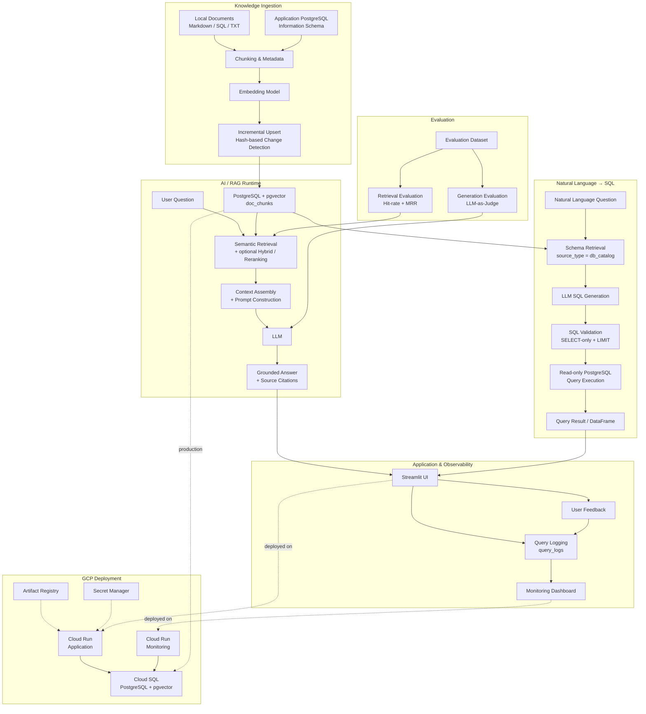

### Core Components

* **Knowledge Ingestion** — `rag/ingestion/ingest.py` supports local documents and live PostgreSQL catalog introspection, with chunking, embeddings, incremental upserts, and stale-chunk cleanup.
* **RAG Pipeline** — `rag/pipeline.py` orchestrates retrieval, context construction, LLM generation, and source attribution.
* **Retrieval** — `rag/retrieval.py` provides semantic retrieval with support for keyword/hybrid retrieval and reranking experiments.
* **NL2SQL** — `rag/nl2sql.py` retrieves database schema context, generates SQL with the LLM, validates it as read-only SQL, executes it against PostgreSQL, and returns the result as a DataFrame.
* **Observability** — `rag/monitoring/` records queries, response times, models, sources, and user feedback for the monitoring dashboard.
* **Evaluation** — `evaluation/evaluate.py` measures retrieval quality using Hit-rate and MRR and supports LLM-as-a-judge evaluation for generated answers.
* **UI** — `app/streamlit_app.py` provides the Schema Assistant and Natural Language → SQL interfaces.
* **Cloud Deployment** — The application is containerized and deployed to Google Cloud Run, with PostgreSQL/pgvector hosted on Cloud SQL and container images stored in Artifact Registry.


---

## 4. Project Structure

```text
db-rag-assistant/
├── app/
│   └── streamlit_app.py
│       # Streamlit UI for the DB Schema Assistant and
│       # Natural Language → SQL interface, including
│       # source citations and user feedback.
│
├── assets/
│   # Application assets and supporting resources.
│
├── data/
│   ├── add_column_comments.sql
│   │   # SQL statements for adding documentation/comments
│   │   # to database columns.
│   ├── audit_enum_candidates.sql
│   │   # SQL used to identify and audit candidate enum-like
│   │   # values in the database.
│   ├── eval_questions_categorized.json
│   │   # Categorized evaluation questions used for retrieval
│   │   # and answer-quality evaluation.
│   ├── eval_questions.json
│   │   # Evaluation question dataset.
│   ├── schema_notes.md
│   │   # Human-written database schema documentation and notes.
│   ├── schemas_ddl.sql
│   │   # Database DDL definitions used as source knowledge
│   │   # for the RAG system.
│   └── sql_eval_questions.json
│       # Natural Language → SQL evaluation questions.
│
├── db/
│   ├── doc_chunks_indexes.sql
│   │   # Index definitions for the doc_chunks knowledge store,
│   │   # including indexes used for retrieval.
│   ├── doc_chunks.sql
│   │   # Schema definition for the document/chunk knowledge store
│   │   # containing document metadata and vector embeddings.
│   ├── query_logs.sql
│   │   # Schema definition for storing application queries,
│   │   # generated answers/SQL, timing, model information,
│   │   # sources, and user feedback.
│   └── schema.sql
│       # Main PostgreSQL schema initialization script for
│       # the RAG application database.
│
├── docker-compose-with-ollama.yml
│   # Docker Compose configuration for running the application
│   # with a local Ollama LLM service.
│
├── docker-compose-without-ollama.yml
│   # Docker Compose configuration for running the application
│   # without the local Ollama service, suitable for external
│   # OpenAI-compatible LLM providers.
│
├── docker-compose.yml
│   # Main Docker Compose configuration for managing the
│   # multi-container application stack.
│
├── Dockerfile
│   # Instructions for building the main application container image.
│
├── Dockerfile.kestra
│   # Dockerfile for the Kestra orchestration service.
│
├── docker-start.sh
│   # Windows command script for starting the Docker services.
│
├── docker-stop.sh
│   # Windows command script for stopping the Docker services.
│
├── evaluation/
│   ├── eval_questions_categorized.json
│   │   # Categorized retrieval/generation evaluation dataset.
│   ├── eval_questions.json
│   │   # Evaluation question dataset used by the evaluation suite.
│   ├── evaluate.py
│   │   # Evaluation suite for retrieval and generation quality,
│   │   # including Hit-rate, MRR, and LLM-as-a-judge evaluation.
│   ├── run-evaluate.sh
│   │   # Shell script for running the evaluation workflow.
│   └── sql_eval_questions.json
│       # Evaluation dataset for the Natural Language → SQL workflow.
│
├── infra/
│   └── gcp/
│       ├── doc/
│       │   ├── cloud-design-decisions.md
│       │   │   # Documentation of key GCP architecture and
│       │   │   # infrastructure design decisions.
│       │   ├── gcp-deployment-troubleshooting.md
│       │   │   # Troubleshooting notes and solutions for GCP deployment.
│       │   ├── migrate-repo-windows-to-linux.md
│       │   │   # Notes for migrating and synchronizing the project
│       │   │   # development environment from Windows to Linux.
│       │   └── stop-start-services.md
│       │       # Operational notes for stopping and restarting
│       │       # deployed GCP services.
│       │
│       ├── main.tf
│       │   # Main Terraform configuration for provisioning
│       │   # the GCP infrastructure.
│       ├── outputs.tf
│       │   # Terraform output definitions such as deployed
│       │   # service URLs and infrastructure identifiers.
│       ├── terraform.tfvars.example
│       │   # Example Terraform variable values without
│       │   # environment-specific secrets.
│       ├── variables.tf
│       │   # Terraform input variable definitions.
│       └── versions.tf
│           # Terraform and provider version constraints.
│
├── kestra/
│   └── flows/
│       ├── db_catalog_ingestion.yaml
│       │   # Kestra flow for ingesting the PostgreSQL database
│       │   # catalog/schema metadata into the RAG knowledge store.
│       ├── local_file_ingestion.yaml
│       │   # Kestra flow for ingesting local documentation files
│       │   # into the RAG knowledge store.
│       └── rag_ingestion.yaml
│           # Combined Kestra flow for RAG ingestion from both
│           # local files and database catalog sources.
│
├── notebooks/
│   └── db_rag_assistant_progress_test.ipynb
│       # Development and experimentation notebook used for
│       # testing and tracking project progress.
│
├── rag/
│   ├── config.py
│   │   # Central configuration for database connections,
│   │   # LLM, embedding model, and runtime settings.
│   │
│   ├── generation.py
│   │   # Builds prompts from retrieved context and invokes
│   │   # the configured LLM to generate grounded answers.
│   │
│   ├── ingestion/
│   │   ├── db_rag_ingestion.yml
│   │   │   # Configuration for the RAG ingestion workflow.
│   │   └── ingest.py
│   │       # Incremental ingestion pipeline: reads local documents
│   │       # or database catalog metadata, chunks content, generates
│   │       # embeddings, upserts changed chunks, and removes stale chunks.
│   │
│   ├── load_db_catalog.py
│   │   # Loads PostgreSQL catalog/schema metadata into the
│   │   # doc_chunks knowledge store.
│   │
│   ├── monitoring/
│   │   ├── logger.py
│   │   │   # Logging helpers for recording queries, answers,
│   │   │   # SQL, sources, response time, model information,
│   │   │   # and user feedback.
│   │   └── monitoring_dashboard.py
│   │       # Monitoring dashboard for query volume, latency,
│   │       # model usage, and user feedback across assistants.
│   │
│   ├── nl2sql-cloud.py
│   │   # Cloud/OpenAI-compatible implementation of the
│   │   # Natural Language → SQL workflow.
│   │
│   ├── nl2sql-local.py
│   │   # Local implementation of the Natural Language → SQL
│   │   # workflow using an open-source/local LLM platform.
│   │
│   ├── nl2sql.py
│   │   # Main Natural Language → SQL pipeline:
│   │   # schema retrieval, LLM SQL generation, SQL guardrails,
│   │   # read-only execution, result handling, and query logging.
│   │
│   ├── pipeline.py
│   │   # End-to-end RAG orchestration from retrieval through
│   │   # context construction and LLM generation.
│   │
│   └── retrieval/
│       └── retrieval.py
│           # Retrieval implementation supporting semantic search
│           # and hybrid retrieval, with optional cross-encoder
│           # re-ranking for retrieval experiments.
│
├── README-Cloud-Deployment.md
│   # Documentation for deploying the application to GCP.
│
├── README.md
│   # Main project documentation covering the architecture,
│   # implementation, evaluation, usage, and deployment.
│
├── requirements.txt
│   # Python dependencies required by the application,
│   # RAG pipeline, evaluation, and supporting components.
│
└── scripts/
    ├── deploy_kestra_flows.sh
    │   # Deploys Kestra flow definitions.
    ├── ingest_db_catalog.sh
    │   # Runs database catalog/schema ingestion.
    └── ingest_local_file.sh
        # Runs local document ingestion.
```

---
## 5. Technology / Tools

| Technology / Tool                                         | Role in this project                                                                                                                                                                                                                                                           |
| --------------------------------------------------------- | ------------------------------------------------------------------------------------------------------------------------------------------------------------------------------------------------------------------------------------------------------------------------------ |
| **PostgreSQL + pgvector**                                 | Core database and vector store. The same PostgreSQL instance stores document embeddings in `doc_chunks` and application/interaction telemetry in `query_logs`, avoiding the need for a separate vector database.                                                               |
| **sentence-transformers** (`all-MiniLM-L6-v2`)            | Local embedding model used to convert documents, database schema information, and user questions into vector representations for semantic retrieval. The embedding model is also reused by the NL2SQL schema-retrieval path.                                                   |
| **PostgreSQL Full-Text Search (`tsvector` / `ts_rank`)**  | Keyword-based retrieval mechanism implemented as part of the hybrid-search experiments. It complements semantic retrieval for exact or lexical matches.                                                                                                                        |
| **Semantic / Hybrid Retrieval + Cross-Encoder Reranking** | Retrieval layer supporting semantic search, hybrid search, and optional cross-encoder reranking. These strategies were implemented and evaluated experimentally; semantic-only retrieval produced the strongest measured retrieval results for the current evaluation dataset. |
| **LLM via OpenAI-Compatible API**                         | Used for answer generation in the DB Schema Assistant and SQL generation in NL2SQL. The provider and model are configurable through `OPENAI_BASE_URL` and `LLM_MODEL`, allowing the same application code to work with local or cloud-hosted LLM endpoints.                    |
| **Ollama**                                                | Local LLM runtime used for development and local experimentation with open-source models through an OpenAI-compatible interface.                                                                                                                                               |
| **Cloud LLM Provider**                                    | Cloud-based LLM execution is supported through the same OpenAI-compatible interface. The deployed NL2SQL implementation uses a configurable cloud model endpoint, allowing model changes without changing the application architecture.                                        |
| **Streamlit**                                             | Application interface for the DB Schema Assistant, Natural Language → SQL assistant, and RAG Monitoring Dashboard. The application provides source information and user feedback for assistant responses.                                                                      |
| **Docker + Docker Compose**                               | Containerization and local service orchestration for the application, PostgreSQL/pgvector, LLM runtime where required, Kestra, and supporting services. Multiple Compose configurations are provided for different local execution scenarios.                                  |
| **Kestra**                                                | Workflow orchestration for incremental RAG ingestion. The flows support local-file ingestion, database-catalog ingestion, or combined RAG ingestion and can be triggered repeatedly without rebuilding the complete index.                                                     |
| **psycopg2**                                              | PostgreSQL connectivity layer used across ingestion, vector retrieval, database-catalog introspection, NL2SQL execution, query logging, and monitoring.                                                                                                                        |
| **pandas**                                                | Data processing layer used for NL2SQL query results, monitoring analytics, and evaluation workflows. NL2SQL returns query results as DataFrames, while the monitoring dashboard uses pandas to calculate query volume, latency, feedback, and pipeline timing metrics.         |
| **Terraform**                                             | Infrastructure-as-Code used to provision and manage the GCP deployment rather than configuring cloud infrastructure manually.                                                                                                                                                  |
| **Google Cloud Run**                                      | Serverless container platform used to deploy the application and monitoring services. The architecture supports scale-to-zero operation when the services are idle.                                                                                                            |
| **Google Cloud SQL for PostgreSQL**                       | Managed PostgreSQL database used as the cloud database backend for the deployed application, including the RAG/vector data and application logging data.                                                                                                                       |
| **Google Artifact Registry**                              | Stores the container image used to deploy the application to Cloud Run.                                                                                                                                                                                                        |
| **Google Secret Manager**                                 | Stores deployment secrets and sensitive configuration separately from application source code.                                                                                                                                                                                 |
| **Jupyter Notebook**                                      | Used during development and experimentation to test the RAG pipeline and document project progress before integrating functionality into the application.                                                                                                                      |
| **Python**                                                | Primary implementation language for ingestion, retrieval, generation, NL2SQL, monitoring, evaluation, and supporting automation scripts.                                                                                                                                       |

### Technology Architecture Principles

The technology choices follow several engineering principles:

1. **PostgreSQL as the central data platform**
   PostgreSQL is used for both operational application data and vector retrieval through pgvector. This reduces infrastructure complexity by avoiding a separate vector database.

2. **Provider-agnostic LLM integration**
   LLM access is implemented through an OpenAI-compatible interface. The endpoint and model are configuration-driven, allowing local Ollama-based development and cloud LLM execution without changing the core application flow.

3. **Local embedding to reduce external dependencies**
   `all-MiniLM-L6-v2` provides local embeddings for semantic retrieval, eliminating the need for a separate embedding API.

4. **Retrieval evaluated rather than assumed**
   Semantic retrieval, keyword retrieval, hybrid retrieval, and reranking were implemented as alternatives and evaluated using the project evaluation dataset. The architecture therefore reflects measured retrieval behavior rather than assuming that a more complex retrieval pipeline is automatically better.

5. **Safety-oriented NL2SQL execution**
   NL2SQL does not directly execute unrestricted LLM-generated SQL. The implementation retrieves only relevant `db_catalog` schema information, asks the LLM for a single SELECT statement, validates the generated SQL, adds a default result limit when required, and executes it inside a read-only PostgreSQL transaction.

6. **Incremental ingestion**
   The ingestion pipeline detects changed content, embeds only changed chunks, upserts them into pgvector, and removes stale chunks. This allows ingestion to be executed repeatedly by an orchestrator without rebuilding the entire index.

7. **Shared observability**
   Both the DB Schema Assistant and NL2SQL write interaction data to `query_logs`. The monitoring layer uses this shared telemetry to expose query volume, response latency, model information, retrieval/generation timing, and user feedback.

8. **Infrastructure as Code for cloud deployment**
   GCP resources are managed through Terraform, with the application and monitoring components deployed as Cloud Run services and PostgreSQL hosted on Cloud SQL. Container images are stored in Artifact Registry and sensitive configuration is separated into Secret Manager.

---

## 6. Incremental Ingestion

Ingestion is designed to be **incremental and repeatable**, rather than a one-shot full reload.

A naive implementation of `ingest.py` could truncate the existing index and rebuild every embedding on each run. While this is acceptable for a small demo, it becomes inefficient as documentation and database schemas evolve.

The current ingestion pipeline uses content-based change detection:

* Each document chunk is assigned a `content_hash`.
* If an incoming chunk has the same hash as the stored version, it is **skipped**, avoiding unnecessary re-embedding.
* New or modified chunks are **upserted** using PostgreSQL `ON CONFLICT ... DO UPDATE`.
* Chunks that are no longer present in the source are **removed** from the index.

This gives the ingestion process repeatable, incremental behavior and makes it suitable for execution by an orchestrator without rebuilding the entire knowledge base on every run.

### Ingesting `local_file`

The `local_file` mode indexes supported files from a local directory.

Inside the `app` service (`db-rag-app`):

* **Source:** `/app/data`
* **Source type:** `local_file`

```bash
docker exec db-rag-app \
  python /app/rag/ingestion/ingest.py \
  --source /app/data \
  --source-type local_file
```

This mode is useful for DDL files, Markdown documentation, schema notes, and other supported text-based knowledge sources.

### Ingesting `db_catalog`

The `db_catalog` mode can introspect a PostgreSQL database directly instead of relying exclusively on manually maintained documentation.

The ingestion process reads database metadata from PostgreSQL catalog information and generates searchable schema documentation for the target database, including information such as:

* tables and columns
* data types
* nullability
* primary-key and foreign-key relationships
* `COMMENT ON TABLE` metadata
* `COMMENT ON COLUMN` metadata

The target database can be different from the PostgreSQL database that stores the RAG application's `doc_chunks` and `query_logs` tables.

Example:

```bash
docker exec db-rag-app \
  python /app/rag/ingestion/ingest.py \
  --source "host=db port=5432 dbname=postgres user=postgres password=postgres" \
  --source-type db_catalog
```

This approach reduces the risk of documentation drift because the schema knowledge can be generated directly from the database being documented.

Like `local_file` ingestion, `db_catalog` ingestion is incremental: unchanged schema information does not need to be re-embedded on every run.

### Ingestion with Kestra

The project also includes **Kestra** for workflow orchestration. Kestra and its PostgreSQL backend run as services in `docker-compose.yml` and share the `zoomcamp_net` Docker network with the application services.

The repository provides three flows:

1. **`local_file_ingestion`** — runs ingestion for `source-type=local_file`.
2. **`db_catalog_ingestion`** — runs ingestion for `source-type=db_catalog`.
3. **`rag_ingestion`** — orchestrates both local-file and database-catalog ingestion.

The workflows support two execution patterns:

* **Scheduled execution** — configured with an hourly cron trigger.
* **On-demand execution** — triggered through a webhook when ingestion is required after documentation or schema changes.

Task failures are surfaced in the Kestra UI, providing basic operational visibility into the ingestion workflow.

### Ingestion Architecture

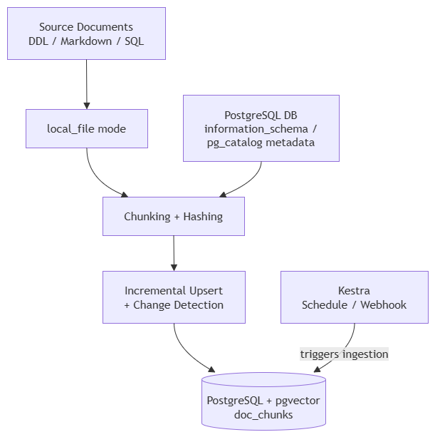

The resulting knowledge base can therefore be refreshed repeatedly while minimizing unnecessary embedding work and keeping indexed documentation aligned with its source.

---
## 7. Model Selection and Configuration

The generation layer is implemented through the **OpenAI SDK interface**, allowing the application to use both local and cloud-hosted models through an OpenAI-compatible API.

This abstraction keeps model configuration separate from the application logic. The same RAG and NL2SQL code can therefore be used with a local Ollama model during development or a cloud model when higher-capability generation is required.

### Local Models — Ollama

For local development and experimentation, the project can connect to an Ollama server running as the `ai_ollama` Docker service.

A local model can be installed with:

```bash
ollama pull gemma3:4b
```

Several models were tested against the project's actual questions, with response quality and latency compared through the monitoring data and manual inspection of generated answers.

Models tested during development included:

```text
NAME                 ID              SIZE
llama3:8b            365c0bd3c000    4.7 GB
ministral-3:3b       f04aa1c738f6    3.0 GB
qwen3:8b             500a1f067a9f    5.2 GB
gemma3:4b            a2af6cc3eb7f    3.3 GB
```

The local model can be selected through `.env`:

```dotenv
OPENAI_API_KEY=ollama
OPENAI_BASE_URL=http://ai_ollama:11434/v1
LLM_MODEL=gemma3:4b

# Alternative local models:
# LLM_MODEL=qwen3:8b
# LLM_MODEL=ministral-3:3b
# LLM_MODEL=llama3:8b
```

The purpose of these experiments was not to identify a universally "best" model, but to understand the trade-offs between **generation quality, latency, local compute requirements, and compatibility with the application's RAG and NL2SQL workflows**.

### Cloud Model — Groq

For cloud-based generation, the application can use the **Groq OpenAI-compatible API**.

The current cloud configuration uses:

```dotenv
OPENAI_API_KEY=<your-api-key>
OPENAI_BASE_URL=https://api.groq.com/openai/v1
LLM_MODEL=qwen/qwen3.8-27b
```

The `qwen/qwen3.8-27b` model was selected for the current cloud workflow after testing model behavior with the project's actual NL2SQL workload. In particular, an earlier model configuration produced reasoning output wrapped in `<think>` tags that interfered with the application's single-statement SQL validation. Switching to the current model configuration resolved that issue in the tested workflow.

This illustrates an important engineering principle in the project: **model selection is evaluated against the application's complete pipeline, not only against standalone response quality**.

A model must work correctly with:

* RAG context construction
* generation prompts
* output parsing
* SQL validation
* read-only execution
* latency requirements
* monitoring and logging

### Environment-Based Model Switching

Model and provider configuration is kept outside the application code through environment variables.

The project maintains separate environment configurations for local and cloud development:

```text
.env
.env.local
.env.cloud
```

To use the cloud configuration:

```bash
cp .env.cloud .env
```

Then set the required API key and model parameters in `.env`.

For local Ollama:

```bash
cp .env.local .env
```

This approach allows the same application image and codebase to switch between local and cloud generation without changing the RAG, NL2SQL, or monitoring implementation.

### Model Selection Architecture


The architecture deliberately separates **model/provider configuration from application behavior**, making model experimentation and deployment changes easier without modifying the core application logic.

---
## 8. Retrieval

The retrieval layer is designed specifically for a relatively small database-schema and documentation corpus, with an emphasis on **accuracy, predictable behavior, and practical CPU performance**.

The implemented retrieval flow supports three strategies:

```text
User Question
     │
     ├── Exact Table Match ────────────────┐
     │                                     │
     └── Semantic Retrieval                │
             │                             │
             ├── Semantic-only             │
             │                             │
             └── Hybrid Search             │
                    │                      │
                    └── Optional Reranker  │
                                           │
                                           ▼
                                  Retrieved Chunks
```

### 8.1 Exact Table-Name Match

When a user explicitly mentions a known table name, the retrieval layer can identify that table and retrieve its indexed chunks directly.

This provides a deterministic path for questions such as:

```text
"Explain the patients table."
"What columns are available in claims?"
```

For these questions, there is no need to perform the full semantic retrieval and reranking pipeline.

This approach is particularly useful for database-schema assistants because table names are strong signals and can be matched directly against the indexed `table_name` metadata.

### 8.2 Semantic Retrieval

Semantic retrieval uses the `all-MiniLM-L6-v2` SentenceTransformer model to encode the user question and performs vector similarity search against the `embedding` column in PostgreSQL/pgvector.

This is the primary retrieval strategy for the current implementation.

The same embedding model instance is reused by the NL2SQL schema-retrieval path, avoiding unnecessary loading of the SentenceTransformer model multiple times in memory.

### 8.3 Hybrid Search

The project also implements hybrid retrieval by combining:

* **Semantic search** using pgvector
* **Keyword search** using PostgreSQL full-text search
* **Reciprocal Rank Fusion (RRF)** to combine the resulting rankings

Hybrid retrieval was implemented as an experimental alternative to determine whether combining semantic and lexical signals improves retrieval quality for the database-schema corpus.

The project does not assume that hybrid retrieval is automatically superior. Retrieval strategies are evaluated empirically against the project's evaluation dataset.

### 8.4 Optional Cross-Encoder Re-Ranking

A cross-encoder reranking stage is available as an optional retrieval component.

It can be enabled or disabled through:

```text
ENABLE_RERANKER
```

The reranker is intentionally optional because cross-encoder inference introduces additional CPU latency. For CPU-only deployments where response time is important, the reranker can remain disabled.

The repository therefore supports a progression from a lightweight retrieval path to a more expensive retrieval pipeline:

```text
Semantic Retrieval
       │
       ├── No reranking
       │
       └── Cross-Encoder Reranking
```

The cross-encoder approach was evaluated as part of the retrieval experiments rather than being assumed to improve the final system.

### 8.5 Retrieval Evaluation

The retrieval implementation was evaluated using the project's healthcare-schema question set.

The evaluation compares:

| Retrieval strategy |   Hit Rate |       MRR |
| ------------------ | ---------: | --------: |
| **Semantic-only**  | **93.52%** | **0.799** |
| Hybrid             |     88.43% |     0.767 |
| Hybrid + reranking |     85.65% |     0.759 |
| Keyword-only       |      6.48% |     0.052 |

For the current evaluation dataset, **semantic-only retrieval produced the strongest measured retrieval results**.

This result influenced the final engineering design: the system retains hybrid search and reranking as available retrieval strategies, but does not add retrieval complexity simply for the sake of using a more sophisticated pipeline.

> **Engineering takeaway:** More retrieval stages do not necessarily produce better results. The final configuration is guided by measured retrieval quality and the latency/cost characteristics of the deployment environment.

### 8.6 Retrieval and NL2SQL

The NL2SQL component reuses the existing RAG index but applies a specialized schema-retrieval path.

Only chunks with:

```text
source_type = 'db_catalog'
```

are retrieved so that the LLM receives database table and column definitions rather than general documentation.

The retrieved schema context is then passed to the LLM for SQL generation. The implementation retrieves the relevant schema chunks from `doc_chunks` using vector similarity and returns both the schema context and table names used for monitoring.

The resulting flow is:

```text
Natural Language Question
          │
          ▼
   Schema Retrieval
   source_type=db_catalog
          │
          ▼
     Schema Context
          │
          ▼
       LLM SQL
      Generation
          │
          ▼
      SQL Validation
          │
          ├── SELECT / WITH only
          ├── Single statement
          ├── Forbidden commands rejected
          └── LIMIT added when required
          │
          ▼
   Read-Only PostgreSQL
      Transaction
          │
          ▼
      DataFrame Result
```

The generated SQL is validated before execution and is executed through a read-only PostgreSQL session. The result is returned as a pandas DataFrame and the interaction is logged to `query_logs`.

### 8.7 CPU-Aware LLM Configuration

The application is designed to run in environments where CPU resources and response latency matter.

For Ollama/Qwen3-based local execution, the configuration can use:

```text
LLM_REASONING_EFFORT=none
```

to avoid an additional reasoning pass when it is not required, while:

```text
LLM_MAX_TOKENS
```

limits the maximum generated output.

These parameters are particularly relevant during local CPU-only development and testing.

The LLM itself is accessed through the OpenAI-compatible interface configured through `OPENAI_BASE_URL`, allowing the same retrieval/application code to be used with local or cloud LLM endpoints.

### 8.8 Production / Cloud Considerations

The retrieval design was also tested as part of the GCP deployment.

The architecture deliberately keeps embeddings local to the application and stores vectors in PostgreSQL/pgvector. This avoids introducing a separate managed vector database for the current corpus size.

For cloud execution, the retrieval pipeline can therefore run inside the deployed application container while PostgreSQL/pgvector is provided by Cloud SQL.

The architecture also separates retrieval from LLM generation:

```text
                 Google Cloud
┌─────────────────────────────────────────────┐
│                                             │
│  Cloud Run                                  │
│  ┌───────────────────────────────────────┐  │
│  │ Streamlit Application                 │  │
│  │                                       │  │
│  │  Retrieval → Context → LLM            │  │
│  └───────────────────┬───────────────────┘  │
│                      │                      │
│                      ▼                      │
│              Cloud SQL PostgreSQL           │
│              + pgvector                     │
│              ┌──────────────────────┐       │
│              │ doc_chunks           │       │
│              │ query_logs           │       │
│              └──────────────────────┘       │
│                                             │
└─────────────────────────────────────────────┘
```

This keeps the retrieval architecture relatively simple while allowing the LLM provider and model to change independently through configuration.

### 8.9 Key Design Decision

The final retrieval architecture can be summarized as:

> **Use deterministic table matching when the intent is explicit, semantic retrieval as the primary general-purpose strategy, and hybrid search/reranking as configurable alternatives that are evaluated rather than assumed to be superior.**

This reflects the actual engineering outcome of the project: **retrieval complexity is introduced only when it provides measurable value.**

---

## 9. How to Run

This section provides a complete local quick-start guide for running the project from a fresh clone.

The application can be run with either:

* **Cloud LLM** — uses the Groq OpenAI-compatible API and `qwen/qwen3.8-27b`.
* **Local LLM** — uses Ollama running in Docker.

Both options use the same application, PostgreSQL + pgvector knowledge base, RAG pipeline, NL2SQL workflow, and monitoring dashboard.

Flow:
```text
Clone → Choose Model → Start → Ingest → Open UI → Ask Questions → Monitor → Optional Kestra
```

### 9.1 Prerequisites

Install the following before starting:

* Git
* Python
* Docker
* Docker Compose

For the local-model option, the project also runs an **Ollama container** through Docker Compose.

Clone the repository:

```bash id="j3m6m8"
cd
git clone https://github.com/ketut-garjita/db-rag-assistant.git
cd db-rag-assistant
```

### 9.2 Choose the LLM Mode

#### Option A — Cloud Model

The cloud configuration uses the Groq OpenAI-compatible API.

Copy the cloud Docker Compose and environment configuration:

```bash id="0xk1zp"
cp docker-compose-without-ollama.yml docker-compose.yml
cp rag/nl2sql-cloud.py rag/nl2sql.py
cp .env.cloud .env
```

Open `.env` and configure:

```dotenv id="4trq4q"
OPENAI_API_KEY=<your-api-key>
OPENAI_BASE_URL=https://api.groq.com/openai/v1
LLM_MODEL=qwen/qwen3.8-27b
```

Do not commit `.env` or any file containing API credentials to Git.

#### Option B — Local Model with Ollama

For a fully local setup:

```bash id="0v4k4d"
cp docker-compose-with-ollama.yml docker-compose.yml
cp .env.local .env
cp rag/nl2sql-local.py rag/nl2sql.py
```

Start the application first:

```bash id="j7n4qa"
docker compose up -d --build
```

Then check the Ollama container:

```bash id="3t7h4c"
docker exec ai_ollama ollama list
```

Pull the example model:

```bash id="y4v8e2"
docker exec ai_ollama ollama pull gemma3:4b
```

Verify the installed model:

```bash id="p5r2km"
docker exec ai_ollama ollama list
```

The local configuration uses:

```dotenv id="g1r5x9"
OPENAI_API_KEY=ollama
OPENAI_BASE_URL=http://ai_ollama:11434/v1
LLM_MODEL=gemma3:4b
```

### 9.3 Start the Application

Build and start the selected Docker Compose configuration:

```bash id="q9k2vb"
docker compose up -d --build
```

Verify that the expected services are running:

```bash id="x2m7pc"
docker ps
```

The Compose stack starts the application and its supporting services, including PostgreSQL + pgvector. The local-model configuration also starts the Ollama service.


If a service needs to be restarted, use the appropriate Docker Compose command. On Windows, the repository also provides `docker-start.cmd` as a convenience script.

#### First Database Initialization

On the first initialization of the PostgreSQL volume, the example Healthcare Data Platform schema is created together with the application's RAG and monitoring tables.

The application database includes:

* Healthcare example tables and seed data
* `doc_chunks` — indexed RAG knowledge
* `query_logs` — application queries, performance information, and feedback

The exact initialization behavior depends on whether the PostgreSQL volume already exists. Existing volumes are not reinitialized automatically.

### 9.4 Ingest the Knowledge Base

The application should be populated before asking questions.

#### Local File Ingestion

Run:

```bash id="w8n3kf"
docker exec db-rag-app \
  python /app/rag/ingestion/ingest.py \
  --source /app/data \
  --source-type local_file
```


#### Database Catalog Ingestion

Index the PostgreSQL database catalog:

```bash id="h3q6vz"
docker exec db-rag-app \
  python /app/rag/ingestion/ingest.py \
  --source "host=db port=5432 dbname=postgres user=postgres password=postgres" \
  --source-type db_catalog
```


Both ingestion modes are incremental, so repeated execution does not require rebuilding unchanged embeddings.

### 9.5 Open the Application

Open the Streamlit application:

**http://localhost:8501**


The application provides two assistants.

#### DB Schema Assistant

Example questions:

```text id="e4c1hz"
What columns does patients have?

Which table stores hospital units such as Cardiology and Radiology?

What is the relationship between the patient and billing?
```

Click **Ask** and review the answer and retrieved source context.

#### Natural Language → SQL

Example questions:

```text id="u8d2nm"
What is the total claim_amount grouped by status?

Which insurance_policy has the highest total approved claims?

How many claims does each insurance policy name have?
```

Press **Enter** to execute the generated SQL.

The NL2SQL workflow generates a SQL statement, validates it for read-only execution, applies query limits where required, executes it against PostgreSQL, and displays the result.

After each response, use the **👍 / 👎 feedback controls** to record whether the answer was helpful.

### 9.6 Local and Cloud Model Examples

The repository includes recordings showing the two execution modes.

#### Local Model


#### Cloud Model


The application code and user workflow remain the same; only the model/provider configuration changes.

### 9.7 Monitoring Dashboard

The application records query execution and feedback information in `query_logs`.

Open the monitoring dashboard:

**http://localhost:8502**


The dashboard provides visibility into application usage, latency, assistant type, and user feedback.

This allows model and application behavior to be reviewed using actual runtime data rather than relying only on manual testing.

### 9.8 Optional — Kestra Ingestion Orchestration

For repeated or scheduled ingestion, the repository provides Kestra workflows.

First deploy the flow definitions:

```bash id="r7p4yc"
./scripts/deploy_kestra_flows.sh
```

Open the Kestra UI:

**http://localhost:8080**

The default credentials in the local development configuration are:

```text id="n6b2qw"
Username: admin@kestra.io
Password: Admin1234$
```

> **Security note:** These are local development credentials. Change them before exposing Kestra outside the local development environment.


#### Execute the RAG Ingestion Flow

In the Kestra UI:

```text id="p4w6sa"
Flows
  → rag_ingestion
  → Execute
  → Execute
```


The workflow orchestrates the configured ingestion tasks and reports their execution status in the Kestra UI.

#### Review the Execution

Open the execution result and review the Gantt view:


A successful ingestion execution should report **SUCCESS** for the relevant tasks.


If the UI displays the documented non-blocking error shown above after a successful execution, it does not indicate that the ingestion tasks themselves failed.

#### Enable Scheduled Ingestion

The `rag_ingestion` flow can also be configured with its scheduled trigger.

Open the **Topology** tab and verify the scheduled trigger:


The configured schedule allows the knowledge base to be refreshed automatically rather than requiring manual execution after every source change.

### 9.9 Quick Verification Checklist

After completing the setup, the following workflow should be available:

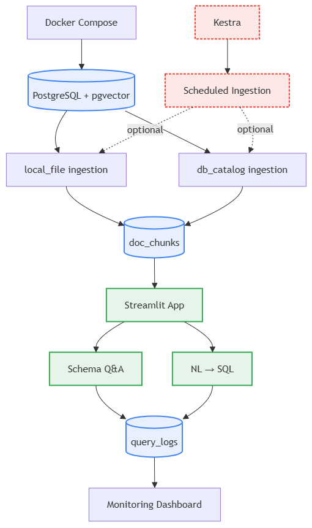

At this point, the repository should be fully runnable locally, with both assistants, the shared RAG knowledge base, monitoring, and optional Kestra-based ingestion orchestration available for experimentation.


---

### 10. Evaluation

The project includes an evaluation framework to measure retrieval quality and validate the behavior of the RAG pipeline before and after engineering changes.

Run the evaluation from the repository home:

```bash
cd <repository-home>

docker compose exec app python evaluation/evaluate.py
```

### 10.1 Retrieval Evaluation

Retrieval quality is evaluated using:

* **Hit-rate** — whether the expected relevant document chunk is retrieved.
* **Mean Reciprocal Rank (MRR)** — how highly the relevant chunk is ranked.

The evaluation compares four retrieval configurations:

| Retrieval strategy |   Hit-rate |       MRR |
| ------------------ | ---------: | --------: |
| Semantic-only      | **93.52%** | **0.799** |
| Hybrid             |     88.43% |     0.767 |
| Hybrid + reranking |     85.65% |     0.759 |
| Keyword-only       |      6.48% |     0.052 |

The results showed that **semantic-only retrieval produced the strongest measured retrieval quality** for the project's documentation and database-schema corpus.

This became an important engineering decision: additional retrieval stages are not automatically better. Hybrid retrieval and cross-encoder reranking remain implemented as configurable alternatives, but they are evaluated empirically rather than assumed to improve accuracy.

The retrieval implementation is located in:

```text
rag/retrieval/retrieval.py
```

The evaluation dataset and evaluation logic are maintained under:

```text
evaluation/
├── eval_questions.json
├── eval_questions_categorized.json
└── evaluate.py
```

### 10.2 Generation Evaluation

The evaluation framework also contains support for generation evaluation using an **LLM-as-judge** approach.

Two system-prompt variants can be compared using a **1–5 relevance score**. The purpose is to evaluate whether changes to the generation prompt improve the relevance of the generated answer.

The generation component is implemented in:

```text
rag/generation.py
```

Generation evaluation is intentionally separated from retrieval evaluation so that retrieval quality and answer-generation quality can be investigated independently.

### 10.3 NL2SQL Validation

The project also evaluates the database-query path through the NL2SQL assistant.

The workflow is:

```text
Natural-language question
        ↓
Retrieve db_catalog schema context
        ↓
LLM generates a single SELECT statement
        ↓
SQL safety validation
        ↓
Read-only PostgreSQL execution
        ↓
Result returned as DataFrame
        ↓
Interaction logged to query_logs
```

The SQL guardrails validate that generated queries are read-only, contain a single statement, and apply a `LIMIT` where appropriate.

This evaluation path is particularly important because retrieval quality alone does not guarantee that an NL2SQL question will produce a safe or executable database query.

### 10.4 Monitoring and User Feedback

Evaluation is complemented by runtime monitoring.

The application records information such as:

* user questions
* generated answers
* response time
* model information
* retrieval/generation timing
* retrieved sources
* user feedback

The Streamlit interface provides **👍 / 👎 feedback**, allowing actual application usage to provide an additional signal beyond offline evaluation.

Monitoring components are located under:

```text
rag/monitoring/
├── logger.py
└── monitoring_dashboard.py
```

The monitoring dashboard provides visibility into query volume, latency, model usage, and user feedback.

### 10.5 Evaluation in the Cloud

The same application architecture can be deployed to GCP, with the application running on **Cloud Run** and PostgreSQL/pgvector hosted on **Cloud SQL**.

The evaluation scripts remain part of the application repository and can therefore be executed against the deployed environment when the required cloud services are running.

This separation makes it possible to distinguish:

```text
Offline evaluation
    → retrieval / generation quality

Runtime monitoring
    → latency / usage / feedback

Cloud deployment
    → operational validation
```

The project therefore treats evaluation as an engineering feedback loop rather than a one-time benchmark:

```text
Implement
   ↓
Evaluate
   ↓
Analyze results
   ↓
Change architecture / configuration
   ↓
Evaluate again
   ↓
Deploy
   ↓
Monitor real usage
```

### 10.6 Key Engineering Takeaway

> **Measure retrieval quality before adding retrieval complexity.**

For this project, semantic retrieval achieved the strongest measured retrieval performance. Hybrid search and cross-encoder reranking were therefore retained as configurable capabilities rather than being enabled simply because they add more processing stages.

This approach keeps the RAG system **measurable, configurable, and practical for both local CPU-based development and the deployed GCP environment**.


---

## 11. Monitoring Dashboard

The project includes a dedicated Streamlit monitoring dashboard for observing application usage, latency, model behavior, and user feedback.

Every interaction handled by the application is logged to the PostgreSQL `query_logs` table through:

```text
rag/monitoring/logger.py
```

The monitoring layer records information such as:

* user question
* generated answer
* retrieved sources
* response time
* retrieval and generation timing information
* model information
* application/assistant name
* user feedback (`up` / `down`)

This provides a persistent operational record that can be analyzed independently from the main assistant UI.

### 11.1 Unified Monitoring

The same `query_logs` table is shared by both assistants:

```text
DB Schema Assistant
        │
        │ app_name = "schema_qa"
        ▼
                  query_logs
        ▲
        │ app_name = "NL2SQL"
        │
Natural Language → SQL Assistant
```

This means the two assistant workflows can be monitored from a single dashboard without requiring separate logging infrastructure.

The NL2SQL implementation logs its interactions to the same monitoring table, allowing its usage and performance to be analyzed alongside the DB Schema Assistant.

### 11.2 Dashboard Metrics

The monitoring dashboard is implemented in:

```text
rag/monitoring/monitoring_dashboard.py
```

It provides top-level operational metrics such as:

* **Total queries**
* **Average latency**
* **Helpful rate**

It also provides a recent-query table for inspecting application activity.

### 11.3 Monitoring Visualizations

The dashboard renders five main visualizations:

1. **Query volume per day**
2. **Queries by assistant**
3. **Average latency by assistant**
4. **Feedback breakdown**
5. **Daily latency trend**

Together, these views provide visibility into both application usage and runtime behavior.

For example, the assistant-level views make it possible to distinguish the behavior of:

```text
schema_qa
NL2SQL
```

rather than treating the entire application as a single workload.

### 11.4 User Feedback

The Streamlit application provides 👍 / 👎 feedback for assistant responses.

Internally, feedback is normalized to:

```text
up
down
```

This allows feedback generated by different assistant interfaces to be stored consistently in `query_logs`.

The monitoring dashboard can then aggregate this feedback into a single feedback breakdown and calculate a helpful-rate metric.

The feedback mechanism therefore provides a simple human-in-the-loop signal that complements the offline evaluation described in [Chapter 10](#10-evaluation).

### 11.5 Monitoring Architecture

The monitoring flow is intentionally simple:

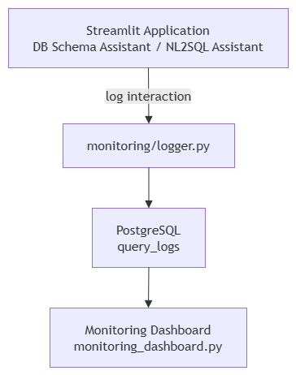


This design avoids introducing a separate observability database for the project's current scale while still providing persistent operational data.

### 11.6 Monitoring in the GCP Deployment

In the GCP deployment, the application and monitoring components can run as separate Cloud Run services while using the PostgreSQL/pgvector database hosted on Cloud SQL.

The resulting architecture separates the user-facing application from the monitoring dashboard while keeping their operational data centralized:

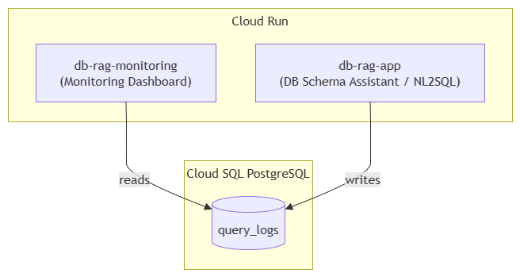

This preserves the same monitoring model used during local development while allowing the dashboard to observe the deployed application environment.

### 11.7 Operational Feedback Loop

Monitoring complements the offline evaluation framework:

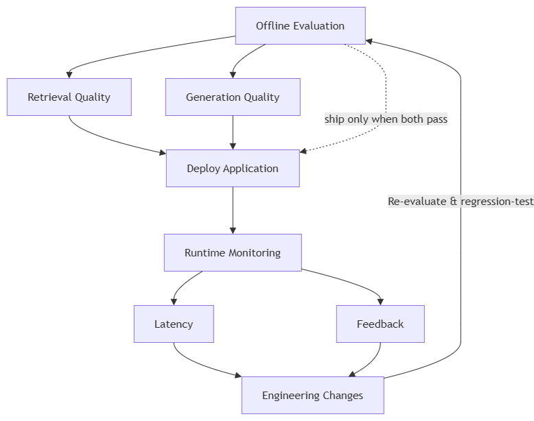


The combination of **offline evaluation + runtime monitoring + user feedback** provides a practical feedback loop for improving the RAG and NL2SQL system based on measured behavior rather than assumptions.

### 11.8 Dashboard Examples


---
## 12. Cloud Deployment (GCP)

The application was deployed to **Google Cloud Platform (GCP)** using **Terraform Infrastructure as Code (IaC)**.

The cloud deployment separates the application, monitoring dashboard, database, secrets, and container image infrastructure while preserving the same RAG/NL2SQL architecture used during local development.

The infrastructure configuration is located under:

```text
infra/gcp/
├── main.tf
├── outputs.tf
├── variables.tf
├── versions.tf
├── terraform.tfvars.example
└── doc/
    ├── cloud-design-decisions.md
    ├── gcp-deployment-troubleshooting.md
    ├── migrate-repo-windows-to-linux.md
    └── stop-start-services.md
```

### 12.1 GCP Architecture

The deployed architecture consists of:

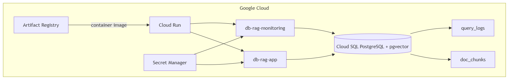

The main application and monitoring dashboard are deployed as separate Cloud Run services, while PostgreSQL with pgvector is hosted on Cloud SQL.

The project therefore keeps the application layer stateless and places persistent RAG and monitoring data in PostgreSQL.

### 12.2 Infrastructure as Code

Terraform is used to provision and manage the GCP resources.

The deployment includes infrastructure for:

* Google Cloud APIs required by the application
* Artifact Registry
* Cloud Run application service
* Cloud Run monitoring service
* Cloud SQL PostgreSQL
* Secret Manager
* IAM permissions
* supporting cloud configuration

Using Terraform provides a reproducible infrastructure definition and keeps the cloud environment separate from application source code.

The deployment state is intentionally retained so that resources can be stopped, restarted, or recreated without losing the infrastructure definition.

### 12.3 Authentication and Initial Setup

Two Google authentication contexts are used during deployment:

```bash
gcloud auth login

gcloud auth application-default login

gcloud config set project <project_id>
```

The first authentication is used by the Google Cloud CLI and related container/image operations.

Application Default Credentials are used by Terraform's Google provider.

Create the Terraform variables file from the example:

```bash
cd infra/gcp

cp terraform.tfvars.example terraform.tfvars
```

The real `terraform.tfvars` contains environment-specific values and must never be committed to Git.

### 12.4 Artifact Registry

The container image is stored in Google Artifact Registry.

Create the repository before pushing the application image:

```bash
terraform init

terraform apply \
  -target=google_artifact_registry_repository.repo
```

Configure Docker authentication:

```bash
gcloud auth configure-docker <region>-docker.pkg.dev
```

Build and push the application image from the repository root:

```bash
docker build \
  -t <region>-docker.pkg.dev/<project_id>/db-rag-assistant/app:latest .

docker push \
  <region>-docker.pkg.dev/<project_id>/db-rag-assistant/app:latest
```

The same image URI must then be specified as `app_image_tag` in `terraform.tfvars`.

For the deployed project, the Artifact Registry location is:

```text
asia-southeast2
```

and the image follows the structure:

```text
asia-southeast2-docker.pkg.dev/
<project_id>/
db-rag-assistant/
app:latest
```

### 12.5 Cloud LLM Configuration

The application uses an OpenAI-compatible interface, allowing the LLM provider to be configured independently of the application code.

For example, when using a provider such as Groq:

```text
OPENAI_BASE_URL=https://api.groq.com/openai/v1
```

The corresponding model is configured through:

```text
LLM_MODEL=<model>
```

This separation allows the same application container to support different OpenAI-compatible providers without changing the RAG application architecture.

The deployed NL2SQL implementation uses the configured LLM to generate SQL from retrieved database-schema context. The generated query is then validated and executed through a read-only PostgreSQL connection.

### 12.6 Provision Cloud SQL and Cloud Run

Once the Artifact Registry image exists and the Terraform variables are configured:

```bash
cd infra/gcp

terraform apply
```

Terraform provisions the remaining cloud resources, including:

```text
Cloud SQL
Secret Manager
IAM
Cloud Run — db-rag-app
Cloud Run — db-rag-monitoring
```

Terraform outputs provide the resulting application and monitoring endpoints:

```bash
terraform output
```

### 12.7 Initialize the Cloud SQL Database

Terraform provisions the Cloud SQL instance, but database initialization is handled separately.

Connect to PostgreSQL:

```bash
gcloud sql connect db-rag-postgres --user=postgres
```

Then initialize the database schema:

```sql
\i db/schema.sql
```

This creates the application database structures, including the RAG and monitoring tables.

### 12.8 Populate the RAG Knowledge Base

Cloud Run does not provide the equivalent of:

```bash
docker exec ...
```

used during local development.

Therefore, the deployed Cloud SQL database can be populated using the **Cloud SQL Auth Proxy** from the development environment.

Start the proxy:

```bash
cloud-sql-proxy \
  <project_id>:<region>:db-rag-postgres \
  --port 5433
```

Port `5433` is intentionally used locally so that the proxy does not conflict with another PostgreSQL service listening on the default local port `5432`.

The application image can then be used to run the same ingestion code against Cloud SQL.

#### Local document ingestion

```bash
docker run --rm \
  -e PG_HOST=host.docker.internal \
  -e PG_PORT=5433 \
  -e PG_DB=postgres \
  -e PG_USER=postgres \
  -e PG_PASSWORD=<db_password> \
  -e OPENAI_API_KEY=<key> \
  -e OPENAI_BASE_URL=<base_url> \
  -e LLM_MODEL=<model> \
  <region>-docker.pkg.dev/<project_id>/db-rag-assistant/app:latest \
  python /app/rag/ingestion/ingest.py \
  --source /app/data \
  --source-type local_file
```

#### Database catalog ingestion

```bash
docker run --rm \
  -e PG_HOST=host.docker.internal \
  -e PG_PORT=5433 \
  -e PG_DB=postgres \
  -e PG_USER=postgres \
  -e PG_PASSWORD=<db_password> \
  -e OPENAI_API_KEY=<key> \
  -e OPENAI_BASE_URL=<base_url> \
  -e LLM_MODEL=<model> \
  <region>-docker.pkg.dev/<project_id>/db-rag-assistant/app:latest \
  python /app/rag/ingestion/ingest.py \
  --source "host=host.docker.internal port=5433 dbname=postgres user=postgres password=<db_password>" \
  --source-type db_catalog
```

The ingestion process is incremental: changed chunks are embedded and upserted, while stale chunks can be removed. This allows the same ingestion mechanism to be reused when the documentation or database schema changes.

## 12.9 Cloud Deployment of the RAG and NL2SQL Workloads

The deployed architecture supports both major application workflows:

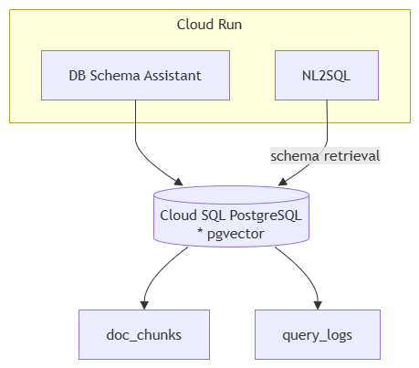

The NL2SQL workflow retrieves only `db_catalog` schema context from `doc_chunks`, generates a single SQL statement, validates it, and executes it using a read-only database transaction.

This means the cloud deployment preserves the same safety and retrieval boundaries established during local development.

## 12.10 Operational Cost Management

Because this project is primarily a learning and portfolio deployment, the GCP infrastructure is configured with cost awareness.

The operational model is:

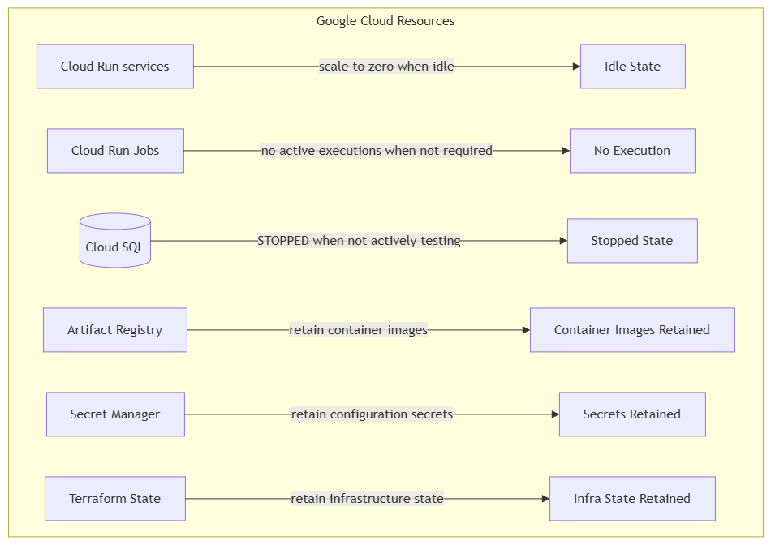

This makes it possible to stop the active compute resources without destroying the complete infrastructure definition.

When the project needs to be demonstrated again, the required services can be restarted and the deployment can be reused.

Detailed operational procedures are documented in:

```text
infra/gcp/doc/stop-start-services.md
```

### 12.11 Deployment Troubleshooting

The deployment process also served as an engineering exercise rather than simply a one-command deployment.

Several practical issues were encountered during the migration from local development to GCP, including:

* existing GCP resources and Terraform state reconciliation
* Artifact Registry image management
* Cloud SQL connectivity
* Cloud SQL Auth Proxy usage
* local port conflicts
* authentication differences between `gcloud` and Terraform
* container execution against the remote database
* Cloud Run deployment behavior

The repository keeps these lessons in:

```text
infra/gcp/doc/gcp-deployment-troubleshooting.md
```

This documentation is intentionally retained as part of the portfolio because it records actual deployment decisions and failure/recovery paths rather than presenting the deployment as a purely theoretical architecture.

### 12.12 Deployment Validation

After deployment, the service endpoints can be retrieved with:

```bash
terraform output
```

The resulting endpoints include:

```text
Application URL
Monitoring URL
Cloud SQL connection name
```

The deployment can then be validated through the same application workflows used locally:

```text
DB Schema Assistant
        ↓
Cloud Run
        ↓
Cloud SQL + pgvector
        ↓
RAG retrieval
        ↓
LLM generation
```

and:

```text
NL2SQL Assistant
        ↓
Schema retrieval
        ↓
LLM SQL generation
        ↓
SQL guardrails
        ↓
Read-only PostgreSQL execution
        ↓
Result + monitoring log
```

### 12.13 Cloud Deployment Design Principle

The GCP deployment demonstrates that the project is not limited to a local Docker environment.

The same core architecture can be moved from:

```text
Local Docker Compose
        ↓
PostgreSQL + pgvector
        ↓
Streamlit
        ↓
LLM provider
```

to:

```text
GCP
├── Cloud Run
├── Cloud SQL + pgvector
├── Artifact Registry
├── Secret Manager
└── Terraform IaC
```

while keeping the RAG, NL2SQL, evaluation, and monitoring components largely unchanged.

### 12.14 Key Engineering Takeaway

> **Separate application logic from infrastructure, and make the infrastructure reproducible.**

Terraform provides the infrastructure definition, Artifact Registry provides immutable deployment artifacts, Cloud Run provides the application runtime, Cloud SQL provides persistent PostgreSQL/pgvector storage, and Secret Manager keeps sensitive configuration outside the application source code.

The result is a portfolio deployment that demonstrates not only RAG and LLM application development, but also **containerization, Infrastructure as Code, cloud database integration, secure configuration, operational troubleshooting, and cost-aware cloud management**.

### 12.15 Screenshoots


---

## 13. Improvements

The current implementation provides an end-to-end RAG and NL2SQL system with retrieval evaluation, monitoring, incremental ingestion, orchestration, and GCP deployment.

There are still several areas that could be improved as the project evolves from a learning/portfolio system toward a more production-oriented AI platform.

### 13.1 Retrieval Improvements

The retrieval experiments showed that additional retrieval stages do not automatically improve retrieval quality.

The current evaluation therefore provides a useful baseline for future experiments:

```text
Semantic-only       → 93.52% hit-rate / 0.799 MRR
Hybrid              → 88.43% hit-rate / 0.767 MRR
Hybrid + reranking  → 85.65% hit-rate / 0.759 MRR
Keyword-only        →  6.48% hit-rate / 0.052 MRR
```

Potential improvements include:

* expanding the evaluation dataset with more real-world questions
* adding more difficult schema and conceptual retrieval cases
* improving chunking strategies for database documentation
* experimenting with different embedding models
* evaluating domain-specific embedding models
* investigating query expansion and query rewriting
* tuning `top_k` and retrieval thresholds
* evaluating metadata-aware retrieval
* investigating hybrid retrieval only where it provides measurable value
* benchmarking reranking with a larger corpus before enabling it by default
* adding retrieval regression tests to prevent future changes from reducing measured quality

The main principle should remain **evaluation-driven retrieval engineering** rather than adding retrieval complexity by default.

### 13.2 Generation Evaluation

Generation evaluation can be expanded beyond the current prompt-comparison approach.

Possible improvements include:

* larger and more diverse evaluation datasets
* automated regression testing for generated answers
* additional LLM-as-judge criteria
* factuality/groundedness evaluation
* citation/source correctness evaluation
* measuring answer quality separately from retrieval quality
* tracking generation latency and token usage
* evaluating multiple LLM providers and models under the same benchmark

This would make it possible to identify whether an observed quality problem originates from:

```text
Retrieval
   ↓
Context quality
   ↓
Prompt
   ↓
LLM generation
```

rather than treating the entire RAG pipeline as a single black box.

### 13.3 NL2SQL Improvements

The NL2SQL assistant currently includes schema retrieval, SQL generation, validation, automatic `LIMIT`, read-only execution, and monitoring.

The next iteration could strengthen the SQL generation and validation layer with:

* SQL parser/AST-based validation instead of relying primarily on regular-expression checks
* schema-aware validation before execution
* explicit table and column existence checks
* query cost or complexity checks
* configurable result-size limits
* database statement timeouts
* better handling of ambiguous questions
* SQL generation regression tests using the existing SQL evaluation dataset
* more comprehensive join and aggregation test cases
* query execution metrics and failure classification

A further improvement would be to separate the generated SQL validation pipeline into independent stages:

```text
LLM-generated SQL
       ↓
Syntax validation
       ↓
Schema validation
       ↓
Read-only validation
       ↓
Complexity / LIMIT checks
       ↓
Read-only execution
```

This would provide stronger defense-in-depth for database-facing LLM workloads.

### 13.4 Ingestion and Data Freshness

The ingestion pipeline already supports incremental processing of local documents and database catalog information.

Future improvements could include:

* scheduled automatic ingestion
* stronger change detection
* document version tracking
* ingestion audit history
* failed-chunk retry mechanisms
* ingestion metrics
* embedding generation monitoring
* configurable batch sizes
* parallel embedding generation where appropriate
* explicit data freshness indicators

The existing Kestra flows provide a foundation for turning ingestion into a more complete scheduled data pipeline.

A future architecture could therefore be:

```text
Source Changes
      ↓
Scheduled / Event Trigger
      ↓
Kestra
      ↓
Incremental Ingestion
      ↓
Chunking
      ↓
Embedding
      ↓
pgvector
      ↓
Evaluation / Monitoring
```

### 13.5 Evaluation as Continuous Regression Testing

The current evaluation framework can evolve into a CI/CD quality gate.

For example:

```text
Code Change
     ↓
Automated Evaluation
     ↓
Retrieval Metrics
     ↓
Generation Metrics
     ↓
SQL Evaluation
     ↓
Quality Thresholds
     ↓
Deploy / Reject
```

This would prevent changes to retrieval, prompts, embeddings, or models from silently degrading application quality.

The evaluation dataset could also be versioned so that benchmark results remain comparable between releases.

### 13.6 Observability and Alerting

The current monitoring dashboard provides visibility into query volume, latency, assistant usage, and user feedback.

The next step would be proactive alerting.

Examples include:

* alert when helpful rate falls below a defined threshold
* alert when latency exceeds a threshold
* alert on repeated SQL generation failures
* alert on database connectivity failures
* alert when ingestion fails
* alert when retrieval quality regression is detected
* alert when cloud resources behave unexpectedly

A notification integration such as Slack could provide operational alerts without requiring the engineer to continuously watch the dashboard.

### 13.7 Monitoring Platform

The current Streamlit monitoring dashboard is appropriate for the project's current scale and keeps the architecture simple.

For a larger deployment, it could be replaced or complemented by a dedicated observability platform such as Grafana.

Potential benefits include:

* longer-term metric retention
* configurable alert rules
* richer dashboards
* multi-user access control
* centralized infrastructure and application metrics
* integration with logs and time-series data

A future architecture could separate application monitoring from the Streamlit application itself:

```text
Application
     │
     ├── Logs
     ├── Metrics
     └── Traces
            │
            ▼
     Observability Stack
            │
            ▼
         Grafana
```

### 13.8 Distributed Tracing

As the architecture becomes more distributed across Cloud Run, Cloud SQL, LLM providers, and orchestration components, request tracing would become increasingly useful.

A future implementation could trace:

```text
User Request
    ↓
Streamlit / Cloud Run
    ↓
Retrieval
    ↓
Embedding Model
    ↓
PostgreSQL / pgvector
    ↓
LLM Provider
    ↓
Generation
    ↓
Response
```

This would make it easier to identify where latency is introduced and distinguish application, database, embedding, and LLM latency.

### 13.9 Security Improvements

The current deployment already separates sensitive configuration from source code through environment configuration and Secret Manager.

Further improvements could include:

* least-privilege IAM policies
* dedicated service accounts
* stricter database roles
* separate read-only database credentials for NL2SQL
* private database connectivity
* network-level access restrictions
* secret rotation
* audit logging
* stronger validation of user-provided input
* container vulnerability scanning

For NL2SQL specifically, database-level read-only permissions should remain an additional safety boundary rather than relying only on application-level SQL validation.

### 13.10 Cloud Architecture Improvements

The current GCP deployment is designed to demonstrate a practical and cost-aware cloud architecture.

Future production-oriented improvements could include:

* Cloud Run Jobs for ingestion and evaluation workloads
* scheduled ingestion jobs
* automated deployment through CI/CD
* separate staging and production environments
* remote Terraform state
* infrastructure drift detection
* automated image vulnerability scanning
* Cloud SQL backup and recovery procedures
* database migration management
* autoscaling and concurrency tuning
* resource-level cost monitoring

The existing Terraform structure provides a foundation for these improvements.

### 13.11 CI/CD

The project could be extended with a complete CI/CD pipeline:

```text
Git Push
   ↓
Lint / Unit Tests
   ↓
Build Docker Image
   ↓
Retrieval / SQL Evaluation
   ↓
Quality Gate
   ↓
Push to Artifact Registry
   ↓
Terraform / Cloud Run Deployment
   ↓
Smoke Tests
```

This would connect the project's software engineering, evaluation, and cloud deployment practices into a single repeatable delivery workflow.

### 13.12 Testing Strategy

The current evaluation suite focuses primarily on retrieval and generation behavior.

A more comprehensive test strategy could introduce separate layers:

```text
Unit Tests
    ↓
Integration Tests
    ↓
Retrieval Evaluation
    ↓
NL2SQL Evaluation
    ↓
End-to-End Tests
    ↓
Cloud Smoke Tests
```

Potential test coverage includes:

* chunking behavior
* embedding generation
* retrieval ranking
* prompt construction
* SQL validation
* read-only execution
* ingestion idempotency
* monitoring/logging
* API/LLM failure handling
* database connectivity
* deployed application health

### 13.13 Performance and Cost Optimization

Performance optimization should be measured together with quality and cloud cost.

Areas for future benchmarking include:

* embedding model latency
* retrieval latency
* PostgreSQL vector-search performance
* reranker latency
* LLM response latency
* token usage
* Cloud Run cold-start behavior
* Cloud SQL resource utilization
* ingestion throughput

The goal is not simply to minimize latency, but to understand the trade-off:

```text
Quality
   ↕
Latency
   ↕
Infrastructure Cost
```

This is particularly relevant when deciding whether additional retrieval or reranking stages provide enough quality improvement to justify their computational cost.

### 13.14 Product and User Experience

The current Streamlit interface demonstrates the core assistant capabilities.

Future UX improvements could include:

* conversation history
* clearer source citations
* SQL explanation mode
* query-result export
* saved queries
* schema exploration
* improved error messages
* loading/progress indicators
* feedback comments in addition to binary feedback
* separate views for DB Schema Assistant and NL2SQL
* role-based access for different users

These improvements would move the project from a technical demonstration toward a more complete internal developer/data-platform assistant.

### 13.15 Future Architecture Direction

Taken together, the improvements suggest a natural evolution from the current portfolio implementation toward a more production-oriented AI data platform:

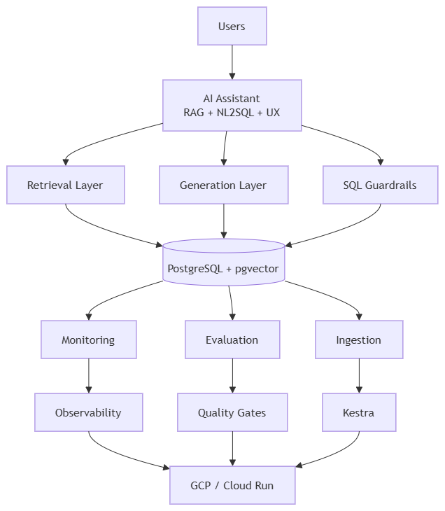


### 13.16 Improvement Philosophy

The project is intentionally designed so that improvements can be introduced incrementally and validated with measurements.

The next stage is therefore not simply **adding more AI components**, but improving the system across four dimensions:

```text
Quality
Reliability
Observability
Operational Efficiency
```

This provides a path from the current learning and portfolio implementation toward a more production-oriented **AI/LLM data engineering platform**.

---

## 14. Evaluation Criterias

Self-assessed against the course rubric, with pointers to where each criterion is satisfied in this repo. Update the ✅/⚠️/❌ marks and notes as the project evolves — this table is meant to be kept honest, not just maximized.

| Criterion | Status | Where / notes |
|---|---|---|
| Problem description | ✅ | [Problem statement](#1-problem-statement) above — the doc-fragmentation problem and how RAG solves it |
| Retrieval flow | ✅ | Knowledge base (`doc_chunks` in pgvector) + LLM both used — `rag/pipeline.py`, `nl2sql.py` |
| Retrieval evaluation | ✅ | `evaluation/evaluate.py` compares **5 approaches** (semantic-only, keyword-only, hybrid, hybrid+reranked, hybrid+reranked+query-rewriting) on hit-rate/MRR; the winner is used in production (`rag/pipeline.py`) |
| LLM evaluation | ✅ | `evaluation/evaluate.py` compares **2 system-prompt variants** via LLM-as-judge (1-5 relevance score); the better-scoring prompt is the one shipped in `rag/generation.py` |
| Interface | ✅ | Streamlit UI — `app/streamlit_app.py` (both assistants) |
| Ingestion pipeline | ✅ | Incremental, hash-based ingestion (`ingestion/ingest.py`), automated via Kestra — `kestra` + `kestra-postgres` run in `docker-compose.yml`, flow at `kestra/flows/db_rag_ingestion.yml` imported and run in the Kestra UI |
| Monitoring | ✅ | Feedback (👍/👎 → `query_logs.feedback`) + dashboard with **5 charts** (`app/monitoring_dashboard.py`): daily volume, queries by assistant, avg latency by assistant, feedback breakdown, latency trend |
| Containerization | ✅ | Everything in `docker-compose.yml` — `db`, `app`, `monitoring` |
| Reproducibility | ✅ | README instructions are complete, the code works end-to-end, and requirements.txt is pinned |
| **Best practices**  | |
| — Hybrid search | ✅ | `rag/retrieval.py` `hybrid_search()` — semantic + keyword, fused and evaluated |
| — Document re-ranking | ✅ | `rag/retrieval.py` `hybrid_search_reranked()` — cross-encoder (`ms-marco-MiniLM-L-6-v2`) re-scores a wider candidate pool; evaluated against plain hybrid in `evaluate.py` and used in production |
| — Query rewriting | ✅ | `rag/retrieval.py` `rewrite_query()` — one LLM call reformulates the question before retrieval; toggle via `ENABLE_QUERY_REWRITING` in `.env`, evaluated on/off in `evaluate.py` |
| **Bonus** | | | |
| Cloud deployment | ✅ | Deployed and verified working on GCP (Cloud Run + Cloud SQL + Artifact Registry + Secret Manager) via Terraform — see [Cloud deployment](#12-cloud-deployment-gcp--live), including a troubleshooting log of every real issue hit along the way |
| Extra bonus (up to 3) |✅ | Candidates worth flagging to reviewers: live-schema ingestion straight from `information_schema` (`db_catalog` source, no manual docs needed), a second full example schema (Healthcare Data Platform, 17 tables) with ER diagram + seed data, unified monitoring across two independently-built assistants, local-LLM support via Ollama with zero code changes |

---

## 15. Acknowledgments

• DataTalks.Club Community — for fostering a vibrant and collaborative learning environment in LLM Zoomcamp.

---
