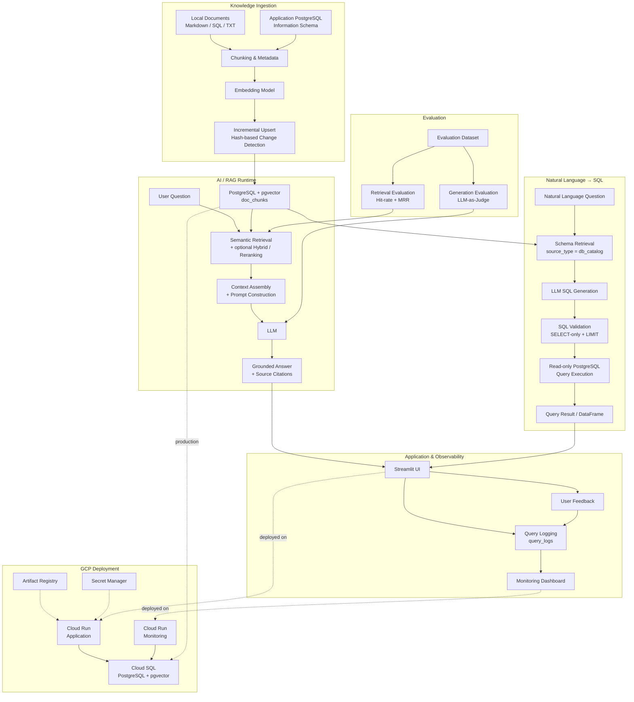

# DB Schema & Query Assistant (RAG)

A **Retrieval-Augmented Generation (RAG)** question-answering assistant for database documentation — table schemas, column descriptions, relationships between tables, and other operational notes. Built following the [LLM Zoomcamp](https://github.com/DataTalksClub/llm-zoomcamp) curriculum, using **PostgreSQL + pgvector** as the vector store.

Two assistants share one knowledge base and one monitoring stack:
- **DB Schema Assistant** — natural-language Q&A over indexed schema documentation
- **Natural Language → SQL** — turns a question into a validated, read-only SQL query and runs it

  

 ## Table of Contents

- [1. Problem Statement](#1-problem-statement)
- [2. Data Sources](#2-data-sources)
- [3. Architecture](#3-architecture)
- [4. Project Structure](#4-project-structure)
- [5. Technology / Tools](#5-technology--tools)
- [6. Flowing Ingestion](#6-flowing-ingestion)
- [7. Choosing Models](#7-choosing-models)
- [8. Retrieval](#8-retrieval)
- [9. How to Run](#9-how-to-run)
- [10. Evaluation Targets](#10-evaluation-targets-optional)
- [11. Monitoring Dashboard](#11-monitoring-dashboard)
- [12. Cloud Deployment (GCP — live)](#12-cloud-deployment-gcp--live)
- [13. Improvements](#13-improvements)
- [14. Evaluation Criterias](#14-evaluation-criterias)
- [15. Acknowledgments](#15-acknowledgments)

---

## 1. Problem Statement

Engineering/DBA teams often waste time hunting for schema information:
"which table stores patient insurance coverage?", "what columns does the `encounters` table have?", "where are laboratory results stored?, what is the relationship between the tables?", etc. Documentation is scattered across wikis, SQL comments, and the memory of
people who have since left the company.

This project indexes all schema documentation (DDL, table/column comments, design notes) into a vector database, then uses an LLM to answer
Natural-Language questions with relevant context — including citing the source (which table/file the answer came from).

---

## 2. Data Sources

Source documents: DDL files (`CREATE TABLE ...`), a `schema_notes.md` file with business-level descriptions per table, and (optionally) an `information_schema` dump from a live database. A minimal example schema of the "Healthcare Data Platform" is provided under `data/`. Other real-world source types are also supported by the ingestion pipeline — e.g. official PostgreSQL documentation pages, internal wikis, or any text/markdown knowledge base (see the "Flowing ingestion" section below).

**ER Diagram & seed data (Healthcare Data Platform example)**

*Note: This solution can be implemented with any application database.*


- `db/schemas.sql` — full DDL for the Healthcare seed data, doc_chunks and query_logs tables
- seed data — representative dummy data covering both outpatient and ER visits, insurance claims in approved/partial/rejected states, etc.).

---

## 3. Architecture

The system is designed as an evaluation-driven RAG and NL2SQL application with separate knowledge ingestion, AI inference, observability, and evaluation workflows.



### Core Components

* **Knowledge Ingestion** — `rag/ingestion/ingest.py` supports local documents and live PostgreSQL catalog introspection, with chunking, embeddings, incremental upserts, and stale-chunk cleanup.
* **RAG Pipeline** — `rag/pipeline.py` orchestrates retrieval, context construction, LLM generation, and source attribution.
* **Retrieval** — `rag/retrieval.py` provides semantic retrieval with support for keyword/hybrid retrieval and reranking experiments.
* **NL2SQL** — `rag/nl2sql.py` retrieves database schema context, generates SQL with the LLM, validates it as read-only SQL, executes it against PostgreSQL, and returns the result as a DataFrame.
* **Observability** — `rag/monitoring/` records queries, response times, models, sources, and user feedback for the monitoring dashboard.
* **Evaluation** — `evaluation/evaluate.py` measures retrieval quality using Hit-rate and MRR and supports LLM-as-a-judge evaluation for generated answers.
* **UI** — `app/streamlit_app.py` provides the Schema Assistant and Natural Language → SQL interfaces.
* **Cloud Deployment** — The application is containerized and deployed to Google Cloud Run, with PostgreSQL/pgvector hosted on Cloud SQL and container images stored in Artifact Registry.


---

## 4. Project Structure

```text
db-rag-assistant/
├── app/
│   └── streamlit_app.py
│       # Streamlit UI for the DB Schema Assistant and
│       # Natural Language → SQL interface, including
│       # source citations and user feedback.
│
├── assets/
│   # Application assets and supporting resources.
│
├── data/
│   ├── add_column_comments.sql
│   │   # SQL statements for adding documentation/comments
│   │   # to database columns.
│   ├── audit_enum_candidates.sql
│   │   # SQL used to identify and audit candidate enum-like
│   │   # values in the database.
│   ├── eval_questions_categorized.json
│   │   # Categorized evaluation questions used for retrieval
│   │   # and answer-quality evaluation.
│   ├── eval_questions.json
│   │   # Evaluation question dataset.
│   ├── schema_notes.md
│   │   # Human-written database schema documentation and notes.
│   ├── schemas_ddl.sql
│   │   # Database DDL definitions used as source knowledge
│   │   # for the RAG system.
│   └── sql_eval_questions.json
│       # Natural Language → SQL evaluation questions.
│
├── db/
│   ├── doc_chunks_indexes.sql
│   │   # Index definitions for the doc_chunks knowledge store,
│   │   # including indexes used for retrieval.
│   ├── doc_chunks.sql
│   │   # Schema definition for the document/chunk knowledge store
│   │   # containing document metadata and vector embeddings.
│   ├── query_logs.sql
│   │   # Schema definition for storing application queries,
│   │   # generated answers/SQL, timing, model information,
│   │   # sources, and user feedback.
│   └── schema.sql
│       # Main PostgreSQL schema initialization script for
│       # the RAG application database.
│
├── docker-compose-with-ollama.yml
│   # Docker Compose configuration for running the application
│   # with a local Ollama LLM service.
│
├── docker-compose-without-ollama.yml
│   # Docker Compose configuration for running the application
│   # without the local Ollama service, suitable for external
│   # OpenAI-compatible LLM providers.
│
├── docker-compose.yml
│   # Main Docker Compose configuration for managing the
│   # multi-container application stack.
│
├── Dockerfile
│   # Instructions for building the main application container image.
│
├── Dockerfile.kestra
│   # Dockerfile for the Kestra orchestration service.
│
├── docker-start.cmd
│   # Windows command script for starting the Docker services.
│
├── docker-stop.cmd
│   # Windows command script for stopping the Docker services.
│
├── evaluation/
│   ├── eval_questions_categorized.json
│   │   # Categorized retrieval/generation evaluation dataset.
│   ├── eval_questions.json
│   │   # Evaluation question dataset used by the evaluation suite.
│   ├── evaluate.py
│   │   # Evaluation suite for retrieval and generation quality,
│   │   # including Hit-rate, MRR, and LLM-as-a-judge evaluation.
│   ├── run-evaluate.sh
│   │   # Shell script for running the evaluation workflow.
│   └── sql_eval_questions.json
│       # Evaluation dataset for the Natural Language → SQL workflow.
│
├── infra/
│   └── gcp/
│       ├── doc/
│       │   ├── cloud-design-decisions.md
│       │   │   # Documentation of key GCP architecture and
│       │   │   # infrastructure design decisions.
│       │   ├── gcp-deployment-troubleshooting.md
│       │   │   # Troubleshooting notes and solutions for GCP deployment.
│       │   ├── migrate-repo-windows-to-linux.md
│       │   │   # Notes for migrating and synchronizing the project
│       │   │   # development environment from Windows to Linux.
│       │   └── stop-start-services.md
│       │       # Operational notes for stopping and restarting
│       │       # deployed GCP services.
│       │
│       ├── main.tf
│       │   # Main Terraform configuration for provisioning
│       │   # the GCP infrastructure.
│       ├── outputs.tf
│       │   # Terraform output definitions such as deployed
│       │   # service URLs and infrastructure identifiers.
│       ├── terraform.tfvars.example
│       │   # Example Terraform variable values without
│       │   # environment-specific secrets.
│       ├── variables.tf
│       │   # Terraform input variable definitions.
│       └── versions.tf
│           # Terraform and provider version constraints.
│
├── kestra/
│   └── flows/
│       ├── db_catalog_ingestion.yaml
│       │   # Kestra flow for ingesting the PostgreSQL database
│       │   # catalog/schema metadata into the RAG knowledge store.
│       ├── local_file_ingestion.yaml
│       │   # Kestra flow for ingesting local documentation files
│       │   # into the RAG knowledge store.
│       └── rag_ingestion.yaml
│           # Combined Kestra flow for RAG ingestion from both
│           # local files and database catalog sources.
│
├── notebooks/
│   └── db_rag_assistant_progress_test.ipynb
│       # Development and experimentation notebook used for
│       # testing and tracking project progress.
│
├── rag/
│   ├── config.py
│   │   # Central configuration for database connections,
│   │   # LLM, embedding model, and runtime settings.
│   │
│   ├── generation.py
│   │   # Builds prompts from retrieved context and invokes
│   │   # the configured LLM to generate grounded answers.
│   │
│   ├── ingestion/
│   │   ├── db_rag_ingestion.yml
│   │   │   # Configuration for the RAG ingestion workflow.
│   │   └── ingest.py
│   │       # Incremental ingestion pipeline: reads local documents
│   │       # or database catalog metadata, chunks content, generates
│   │       # embeddings, upserts changed chunks, and removes stale chunks.
│   │
│   ├── load_db_catalog.py
│   │   # Loads PostgreSQL catalog/schema metadata into the
│   │   # doc_chunks knowledge store.
│   │
│   ├── monitoring/
│   │   ├── logger.py
│   │   │   # Logging helpers for recording queries, answers,
│   │   │   # SQL, sources, response time, model information,
│   │   │   # and user feedback.
│   │   └── monitoring_dashboard.py
│   │       # Monitoring dashboard for query volume, latency,
│   │       # model usage, and user feedback across assistants.
│   │
│   ├── nl2sql-cloud.py
│   │   # Cloud/OpenAI-compatible implementation of the
│   │   # Natural Language → SQL workflow.
│   │
│   ├── nl2sql-local.py
│   │   # Local implementation of the Natural Language → SQL
│   │   # workflow using an open-source/local LLM platform.
│   │
│   ├── nl2sql.py
│   │   # Main Natural Language → SQL pipeline:
│   │   # schema retrieval, LLM SQL generation, SQL guardrails,
│   │   # read-only execution, result handling, and query logging.
│   │
│   ├── pipeline.py
│   │   # End-to-end RAG orchestration from retrieval through
│   │   # context construction and LLM generation.
│   │
│   └── retrieval/
│       └── retrieval.py
│           # Retrieval implementation supporting semantic search
│           # and hybrid retrieval, with optional cross-encoder
│           # re-ranking for retrieval experiments.
│
├── README-Cloud-Deployment.md
│   # Documentation for deploying the application to GCP.
│
├── README.md
│   # Main project documentation covering the architecture,
│   # implementation, evaluation, usage, and deployment.
│
├── requirements.txt
│   # Python dependencies required by the application,
│   # RAG pipeline, evaluation, and supporting components.
│
└── scripts/
    ├── deploy_kestra_flows.sh
    │   # Deploys Kestra flow definitions.
    ├── ingest_db_catalog.sh
    │   # Runs database catalog/schema ingestion.
    └── ingest_local_file.sh
        # Runs local document ingestion.
```

---

## 5. Technology / Tools

| Tool | Role in this project |
|---|---|
| **PostgreSQL + [pgvector](https://github.com/pgvector/pgvector)** | Vector store for document embeddings (`doc_chunks`) and the application's own operational data (`query_logs`) — one database, no separate vector DB needed |
| **[sentence-transformers](https://www.sbert.net/)** (`all-MiniLM-L6-v2`) | Local, free embedding model for semantic search — no external embedding API required |
| **PostgreSQL full-text search (`tsvector`/`ts_rank`)** | Keyword-based half of hybrid search, fused with semantic search via reciprocal rank fusion |
| **LLM via OpenAI-compatible API** ([Ollama](https://ollama.com) locally, or OpenAI/Groq/etc.) | Answer generation (Schema Assistant) and SQL generation (NL2SQL); swappable via `OPENAI_BASE_URL` with no code changes |
| **[Streamlit](https://streamlit.io)** | UI for both assistants, plus the monitoring dashboard — three views: Q&A chat, NL2SQL, and analytics |
| **Docker + Docker Compose** | Full containerization — `db`, `app`, `monitoring`, `ai_ollama`, `llm-postgres`, `kestra` and `kestra-postgres` services, one command to run everything |
| **[Kestra](https://kestra.io)** | Orchestrates incremental ingestion on a schedule or via webhook (see `kestra/flows/`) |
| **pandas** | Data wrangling for the monitoring dashboard and evaluation scripts |
| **psycopg2** | Direct PostgreSQL access for ingestion, retrieval, logging, and NL2SQL query execution |
| **Terraform** | Infrastructure-as-code for cloud deployment (GCP) - see [Ch 12. Cloud Deployment](#12-cloud-deployment-gcp--live)

---

## 6. Flowing Ingestion 
Flowing ingestion are incremental, not one-shot.

The naive version of `ingest.py` would `TRUNCATE` and reload everything on every run — fine for a demo, unrealistic for documentation that keeps
changing. The current version is **incremental**:

- Each chunk is hashed (`content_hash`); if the hash matches what's already   stored, the chunk is **skipped** (no re-embedding → saves API/compute cost).
- New or changed chunks are **upserted** (`ON CONFLICT ... DO UPDATE`).
- Chunks that no longer exist in the source document (trimmed/revised) are   automatically **deleted** from the index.

This makes `ingest.py` safe to call repeatedly from an orchestrator without rebuilding the whole index from scratch every time.

### Ingesting local_file 
Inside app service (container: db-rag-app)
- Source: /app/data
- source-type=local_file
- Command:
  ```
  docker exec db-rag-app python /app/rag/ingestion/ingest.py --source /app/data --source-type local_file
  ```

### Ingesting db_catalog
source-type=db_catalog
Besides local files, `ingest.py` also supports introspecting a real PostgreSQL database's `information_schema` and `pg_catalog` directly — no manual `schema_notes.md` needed. It auto-generates one chunk per table:
columns, data types, PK/FK relationships, nullability, and any `COMMENT ON TABLE`/`COMMENT ON COLUMN` text already set on that database. (see `db/schemas.sql` for an example schema with such comments).

Command:

    ```
    docker exec db-rag-app python /app/rag/ingestion/ingest.py --source "host=db port=5432 dbname=postgres user=postgres password=postgres" --source-type db_catalog
    ```

The `--source` value is a standard libpq connection string pointing at the database you want documented (it can be a different database/schema than the one storing `doc_chunks`). Running this against the Healthcare Data Platform example (after loading `db/healthcare_ddl.sql`) would index all 17 tables automatically, keeping documentation in sync with the actual schema — no drift between docs and reality. Like `local_file`, it's incremental: only tables whose structure changed get re-embedded.

### Ingesting with Kestra Orchestrator

Kestra (and its own backend Postgres, `kestra-postgres`) run as services in `docker-compose.yml`, on the same `zoomcamp_net` network as everything else. 

The flows at:

1. Flow ID of **local_file_ingestion** executing source-ty=e=local_file
2. Flow ID of **db_catalog_ingestion** executing source-type=db_catalog
3. Flow ID of **rag_ingestion** executing both local_file and db_catalog
4. Dual triggers: **scheduled** (hourly cron) and **on-demand** via webhook
   (call it right after editing `/app/data/` or the target schema)
5. Logs a failure message if any task fails (visible in the Kestra UI)

---

## 7. Choosing Models

The generation step uses the OpenAI SDK, which also works against any OpenAI-compatible server including [Ollama](https://ollama.com).

### Local Model
1. An Ollama running under docker
2. Determining the model. You can use gemma3:4 model for this time.
3. Install a model: `ollama pull gemma3:4b`
Several Ollama models were pulled and tested against this project's actual questions, comparing response quality and latency side-by-side on the [monitoring dashboard](#monitoring-dashboard) (`response_time_s` per model, plus manually reviewing `answer` in `query_logs`).

    The following models have already been used and tested.
    ```
    NAME                     ID              SIZE
    llama3:8b                365c0bd3c000    4.7 GB    
    ministral-3:3b           f04aa1c738f6    3.0 GB   
    qwen3:8b                 500a1f067a9f    5.2 GB 
    gemma3:4b                a2af6cc3eb7f    3.3 GB
    ```
    Default model: **gemma3:4b** model.

4. In .env file, set:

    ```
    OPENAI_API_KEY=ollama
    OPENAI_BASE_URL=http://ai_ollama:11434/v1  
    LLM_MODEL=gemma3:4b
    #LLM_MODEL=qwen3:8b
    #LLM_MODEL=ministral-3:3b
    #LLM_MODEL=gemma3:4b
    ```

    ### Cloud Model
    1. Choose free cloud model interface such is Groq [Goq](https://grok.com/)
    2. Get API Key: [Groq API Key](https://console.groq.com/keys)
    3. Use the **qwen/qwen3.8-27b** model
    4. Setup .env file
    ```
    OPENAI_API_KEY=<your API Key>
    OPENAI_BASE_URL="https://api.groq.com/openai/v1"
    LLM_MODEL="qwen/qwen3.8-27b" 
    ```
    
    *Notes:*
    - I have prepared three .env files namely: `.env`, `.env.local` & `.env.cloud`
    - Copy `.env.cloud` to `.env` if you want to use cloud model. Set API_Key and model parameters on .env file.
    - Copy `.env.local' to `'.env' for local model.

---
   
## 8. Retrieval
--> exact table match + hybrid search + optional re-ranking

Retrieval is intentionally optimized for a small database-schema corpus:

1. **Exact table-name match** — questions that explicitly mention a table (for example, `patients`) bypass semantic search and re-ranking and read that table's indexed chunks directly.
2. **Hybrid search** — semantic pgvector search and PostgreSQL full-text search are fused with reciprocal-rank fusion.
3. **Optional cross-encoder re-ranking** — controlled by `ENABLE_RERANKER`; keep it `false` on CPU when latency matters.

The application also reuses the embedding model and a PostgreSQL connection pool. 
For Ollama/Qwen3, `LLM_REASONING_EFFORT=none` disables the extra thinking pass, while `LLM_MAX_TOKENS` bounds output length. These settings are important for keeping a schema assistant responsive on CPU-only hardware.

The repository includes 116 healthcare-specific retrieval evaluation questions in `evaluation/eval_questions.json`, covering all 17 healthcare tables and both direct and conceptual retrieval cases.

---

## 9. How to run

**Using Docker Compose**

Pre-requites:
- python
- git
- Docker & Docker Compose (Linux)

#### STEPS

1. Clone repository
   ```
   cd
   git clone https://github.com/ketut-garjita/db-rag-assistant.git
   ```
2. Goto the repository home directory

   ```
   cd db-rag-assistant
   ```
3. Execute docker compose

    *Option A: Using Cloud Model*
    
    **Provide API_Key and model on .env file !!**
    ```
    cp docker-compose-without-ollama.yml docker-compose.yml    
    cp rag/nl2sql-cloud.py rag/.nl2sql.py
    cp .env.cloud .env
    ```

    Open .env file, set:

    OPENAI_API_KEY=
    LLM_MODEL="qwen/qwen3.8-27b"

    ``` 
    docker compose up -d --build
    ```
    
    *Option B: Using Local Model under Ollama*

    ```
    cp docker-compose-with-ollama.yml docker-compose.yml
    cp .env.local .env
    cp rag/nl2sql-local.py rag/nl2sql.py
    docker compose up -d --build
    ```

    Install model

    ```
    docker exec ai_ollama ollama list
    docker exec ai_ollama ollama pull gemma3:4b
    docker exec ai_ollama ollama list
    ```    
   
3. Review all (6 if using cloud model & 6 if using local model) containers up and running healthy.

   ```
   docker ps
   ```

   
   
    If there are any containers that are not running, execute the command below:

   ```
   docker-start.cmd
   ```
   
   *Note:*

   First time the Postgres volume is initialized, the 17 table of "Healthcare Data Platform" tables automatically created and populated from `db/schema.sql`. In addition, `doc_chunks` and `query_logs` tables also created.   

4. Ingest local file
    ```
    docker exec db-rag-app python /app/rag/ingestion/ingest.py --source /app/data --source-type local_file
    ```
    
   
5. Ingest db catalog
   ```
   docker exec db-rag-app python /app/rag/ingestion/ingest.py --source "host=db port=5432 dbname=postgres user=postgres password=postgres" --source-type db_catalog
   ```
    

6. Open the Streamlit App UI at [http://localhost:8501](http://localhost:8501)
   
    
   
7. Type questions below one-by-one (for an example)

    After answered klick feedback (👍 or 👎)

    DB Schema (Your Question): --> Klick Ask to execute
    ```
    1. What columns does patients have?
    2. Which table stores hospital units such as Cardiology and Radiology?
    3. What is the relationship between the patient and billing?
    ```
    Ask in Natural Language --> SQL: --> type [Enter] to execute
    ```
    1. What is the total claim_amount grouped by status?
    2. Which insurance_policy has the highest total approved claims?
    3. How many claims does each insurance policy name have?
    ``` 
    ### Local Model Responses

    
     

    


    ### Cloud Model Responses

     

    

    
8. Monitoring Dashborad

    Open [http://localhost:8502](http://localhost:8502)

    
    
9. For next data ingestion via `Kestra Orchestrator`, follow steps below:
    
    - **Copy flow files from host to kestra**.

        ```
        ./scripts/deploy_kestra_flows.sh
    
    - **Open Kestra UI**

      http://localhost:8080](http://localhost:8080)

      ```
        Username: admin@kestra.io
        Password: Admin1234$
      ```

      
    
    - **Execute**
      ```
      Flows --> rag_ingestion --> Execute --> Execute
      ```
      *Notes:*
      
      Refresh the page if getting the Connection interrupted message on the right bottom screen.*   
      
      
    
    - **Review Gantt (result)**
      
   
      Note: Ingestion SUCCESS. Ignore the error below it.
   
              
    
    - **Make ingestion trigger running hourly**

      Press the Topology tab.    

       
       
---

## 10. Evaluation Targets

Run with:

cd to the repository HOME 

```
docker compose exec app python evaluation/evaluate.py
```


- **Retrieval**: hit-rate and Mean Reciprocal Rank (MRR), compared across
  three approaches (semantic-only, keyword-only, hybrid) — the script
  reports the best one, which is what `rag/retrieval/retrieval.py` actually uses
- **Generation**: two system-prompt variants compared via LLM-as-judge
  (1-5 relevance score) — the better-scoring prompt is the one shipped in
  `rag/generation.py`
- **Monitoring**: log queries, response time, and user feedback (👍/👎) from the UI

---

## 11. Monitoring Dashboard

Every question asked in `app/streamlit_app.py` is logged to the
`query_logs` table (question, answer/sources, response time, and 👍/👎
feedback) via `monitoring/logger.py`. A separate Streamlit page reads
that table and renders **5 charts** — query volume per day, queries by
assistant, avg latency by assistant, feedback breakdown, and a daily
latency trend line — plus top-level metrics (total queries, avg latency,
helpful rate) and a table of recent queries.

`nl2sql.py` (the "Natural Language to SQL" assistant) is already wired
up to log to the same table under `app_name = "NL2SQL"`, alongside the
DB Schema Assistant's `"schema_qa"` — both show up on one dashboard with
no extra setup. If you use a binary 1/0 feedback signal in the NL2SQL UI
(e.g. from a legacy `nl2sql_feedback`-style table), use the
`feedback_from_int()` wrapper instead of `update_feedback()` so it maps
onto the same `'up'`/`'down'` values transparently:

### Dashboard Examples


---

## 12. Cloud Deployment (GCP — live)

See: README-Cloud-Deployment.md

#### Steps

1. Install the [Google Cloud CLI](https://cloud.google.com/sdk/docs/install)
   and Terraform ≥ 1.5.

2. Authenticate — **two separate logins are required**, for two different
   consumers of your Google credentials:

   ```bash
   gcloud auth login                          # for the gcloud CLI / docker push
   gcloud auth application-default login      # for Terraform's google provider
   gcloud config set project <project_id>
   ```

3. Copy terraform.tfvars.example to terraform.tfvars

    ```bash
    cd infra/gcp && cp terraform.tfvars.example terraform.tfvars
    ```
    
    Fill in real values (never commit this file — it's in `.gitignore`). Set `region` to wherever you  want to deploy.

4. Create the Artifact Registry repo first — you need it to exist before
   you can push an image to it:
   
   ```bash
   terraform init
   terraform apply -target=google_artifact_registry_repository.repo
   ```

5. Build and push the image (from the **repo root**, where the `Dockerfile` is — not from `infra/gcp/`):
   ```bash
   gcloud auth configure-docker <region>-docker.pkg.dev
   docker build -t <region>-docker.pkg.dev/<project_id>/db-rag-assistant/app:latest .
   docker push <region>-docker.pkg.dev/<project_id>/db-rag-assistant/app:latest
   ```

   Put that exact URI in `terraform.tfvars` as `app_image_tag`. If you're using Cloud LLM provider such as OpenAI, Grox, Gemnini (or any non-OpenAI provider), also set `openai_base_url` in `terraform.tfvars` (e.g. `"https://api.groq.com/openai/v1"`).
   
   **Leaving it unset makes the app call real OpenAI, which will reject a key from any other provider.**

6. Create everything else (Cloud SQL, secrets, both Cloud Run services).
    ```bash
    terraform apply
    ```

7. Initialize the Cloud SQL schema

    Terraform provisions the instance but doesn't run SQL against it.

   ```bash
   gcloud sql connect db-rag-postgres --user=postgres
   ```

   then, in psql:
   ```
   \i db/schema.sql
   ```

8. Populate `doc_chunks`

    Cloud Run has no `docker exec`.
  
    Run ingestion locally against the Cloud SQL instance through the Cloud SQL Auth Proxy instead:

    **Note:**

    Require values of:
    - `<db_password>`
    - `<key>` --> OPENAI_API_KEY
    - `<base_url>` --> OPENAI_BASE_URL
    - `<model>` --> LLM _MODEL
    - `<project_id>`
    - `<region>`

    ```bash
    # terminal 1 -- leave running
    cloud-sql-proxy <project_id>:<region>:db-rag-postgres --port 5433

    # terminal 2
    docker run --rm \
      -e PG_HOST=host.docker.internal \
      -e PG_PORT=5433 \
      -e PG_DB=postgres \
      -e PG_USER=postgres \
      -e PG_PASSWORD=<db_password> \
      -e OPENAI_API_KEY=<key> \
      -e OPENAI_BASE_URL=<base_url> \
      -e LLM_MODEL=<model> <region>-docker.pkg.dev/<project_id>/db-rag-assistant/app:latest python /app/rag/ingestion/ingest.py \
      --source /app/data \
      --source-type local_file

    docker run --rm \
      -e PG_HOST=host.docker.internal \
      -e PG_PORT=5433 \
      -e PG_DB=postgres \
      -e PG_USER=postgres \
      -e PG_PASSWORD=<db_password> \
      -e OPENAI_API_KEY=<key> \
      -e OPENAI_BASE_URL=<base_url> \
      -e LLM_MODEL=<model> <region>-docker.pkg.dev/<project_id>/db-rag-assistant/app:latest python /app/rag/ingestion/ingest.py \
      --source "host=host.docker.internal port=5433 dbname=postgres user=postgres password=<db_password>" \
      --source-type db_catalog
    ```

    (Port 5433 rather than Postgres's default 5432 — see troubleshooting below for why.)

9. App and monitoring URLs

    ```bash
    terraform output
    ```

    #### Cloud Design Decisions
    See [Cloud Design Decision](infra/gcp/doc/cloud-design-decisions.md)


    #### Troubleshooting log
    Real issues hit (and fixed) getting this deployment working, in case you hit the same ones see [gcp-deployment-troubleshooting](infra/gcp/doc/gcp-deployment-troubleshooting.md).

    #### Screenshoots

    
    
    
    
    
    
    

---

## 13. Improvements

Other improvements:
- Alerting on the monitoring dashboard (e.g. Slack ping when helpful rate drops below a threshold, or latency spikes)
- Swap the Streamlit dashboard for Grafana if you need longer retention, alert rules, or multi-user access control

---

## 14. Evaluation Criterias

Self-assessed against the course rubric, with pointers to where each
criterion is satisfied in this repo. Update the ✅/⚠️/❌ marks and notes as
the project evolves — this table is meant to be kept honest, not just
maximized.

| Criterion | Status | Where / notes |
|---|---|---|
| Problem description | ✅ | [Problem statement](#1-problem-statement) above — the doc-fragmentation problem and how RAG solves it |
| Retrieval flow | ✅ | Knowledge base (`doc_chunks` in pgvector) + LLM both used — `rag/pipeline.py`, `nl2sql.py` |
| Retrieval evaluation | ✅ | `evaluation/evaluate.py` compares **5 approaches** (semantic-only, keyword-only, hybrid, hybrid+reranked, hybrid+reranked+query-rewriting) on hit-rate/MRR; the winner is used in production (`rag/pipeline.py`) |
| LLM evaluation | ✅ | `evaluation/evaluate.py` compares **2 system-prompt variants** via LLM-as-judge (1-5 relevance score); the better-scoring prompt is the one shipped in `rag/generation.py` |
| Interface | ✅ | Streamlit UI — `app/streamlit_app.py` (both assistants) |
| Ingestion pipeline | ✅ | Incremental, hash-based ingestion (`ingestion/ingest.py`), automated via Kestra — `kestra` + `kestra-postgres` run in `docker-compose.yml`, flow at `kestra/flows/db_rag_ingestion.yml` imported and run in the Kestra UI |
| Monitoring | ✅ | Feedback (👍/👎 → `query_logs.feedback`) + dashboard with **5 charts** (`app/monitoring_dashboard.py`): daily volume, queries by assistant, avg latency by assistant, feedback breakdown, latency trend |
| Containerization | ✅ | Everything in `docker-compose.yml` — `db`, `app`, `monitoring` |
| Reproducibility | ✅ | README instructions are complete, the code works end-to-end, and requirements.txt is pinned |
| **Best practices**  | |
| — Hybrid search | ✅ | `rag/retrieval.py` `hybrid_search()` — semantic + keyword, fused and evaluated |
| — Document re-ranking | ✅ | `rag/retrieval.py` `hybrid_search_reranked()` — cross-encoder (`ms-marco-MiniLM-L-6-v2`) re-scores a wider candidate pool; evaluated against plain hybrid in `evaluate.py` and used in production |
| — Query rewriting | ✅ | `rag/retrieval.py` `rewrite_query()` — one LLM call reformulates the question before retrieval; toggle via `ENABLE_QUERY_REWRITING` in `.env`, evaluated on/off in `evaluate.py` |
| **Bonus** | | | |
| Cloud deployment | ✅ | Deployed and verified working on GCP (Cloud Run + Cloud SQL + Artifact Registry + Secret Manager) via Terraform — see [Cloud deployment](#12-cloud-deployment-gcp--live), including a troubleshooting log of every real issue hit along the way |
| Extra bonus (up to 3) |✅ | Candidates worth flagging to reviewers: live-schema ingestion straight from `information_schema` (`db_catalog` source, no manual docs needed), a second full example schema (Healthcare Data Platform, 17 tables) with ER diagram + seed data, unified monitoring across two independently-built assistants, local-LLM support via Ollama with zero code changes |

---

## 15. Acknowledgments

• DataTalks.Club Community — for fostering a vibrant and collaborative learning environment in LLM Zoomcamp.

---
