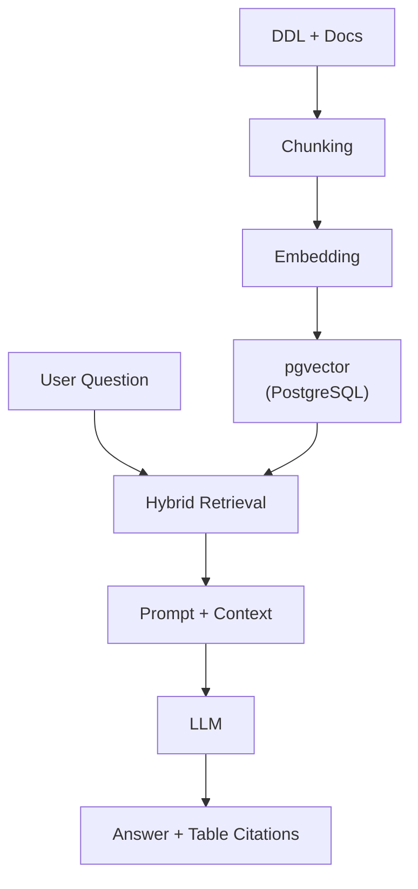

```mermaid
flowchart TD
    A[DDL + Docs]
    B[Chunking]
    C[Embedding]
    D["pgvector\n(PostgreSQL)"]

    A --> B
    B --> C
    C --> D

    U[User Question]
    R[Hybrid Retrieval]
    P[Prompt + Context]
    L[LLM]
    AN[Answer + Table Citations]

    U --> R
    D --> R
    R --> P
    P --> L
    L --> AN
```
